## Prerequisites

- Basics of Reverse Engineering using jadx.
- Should have the capability to understand Java code.
- Capability to write small JavaScript snippets.
- Familiarity with adb.
- Rooted device.

## Frida

Let's start with the first thing. What's Frida ?

[Frida](https://frida.re/) is like a magic tool for your computer or mobile device. It helps  you see what's happening inside other programs or apps, even if you don't have the original code. It's like looking through a window to  understand how things work. Frida can also hook into program's functionality. It's like giving you the power to modify or observe how a program or app works from the inside like,

- **Intercepting Function Calls:** Frida allows you to identify specific functions or methods within a program or app and intercept them. When these functions are called, Frida can make changes to the data they receive or see what they're doing.

- **Observing and Modifying:** You can watch what's happening inside the program in real-time. For example, you can see the values of variables, understand the flow of the program, and even modify the data or code as it's being executed.

- **Debugging and Reverse Engineering**: This capability is valuable for debugging, reverse engineering, and security analysis. It's used by developers to diagnose and fix issues in their software, and by security experts to uncover vulnerabilities and potential threats.

- **Dynamic Analysis:** Unlike traditional debugging tools, Frida doesn't require access to the original source code. It can work with compiled code, making it very useful for examining closed-source applications.

We will cover some of the fundamental Frida usage techniques for analyzing Android applications.

## Setup

To set up Frida, we need to install `frida-tools` on our system and run the `frida-server` on the device. You can install Frida using `pip`.

```
pip install frida-tools
```

Next part is to copy frida server in the device.

```
https://github.com/frida/frida/releases
```

You should select the server based on your architecture. Since I'm using an emulator in my Android Studio, which is x86, I will download the x86 version.

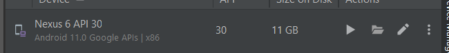

 If you don't know about your device's architecture, use the below adb command.

```
adb shell getprop ro.product.cpu.abi
```

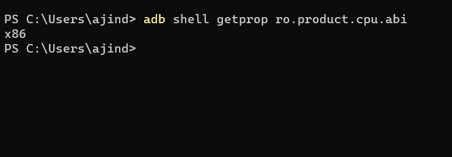

If you device is arm64, download the arm64 server.

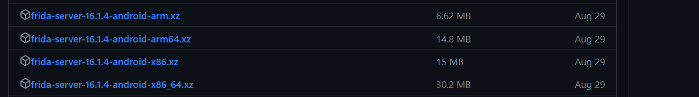

After downloading it, extract it and push it into a writable directory.

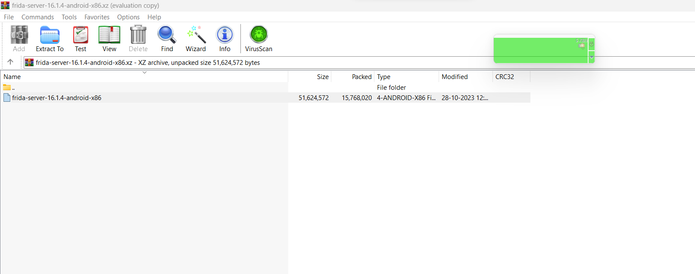

`/data/local/tmp` typically has no problems, so I will push the server there.

```
adb push frida-server-16.1.4-android-x86 /data/local/tmp
```

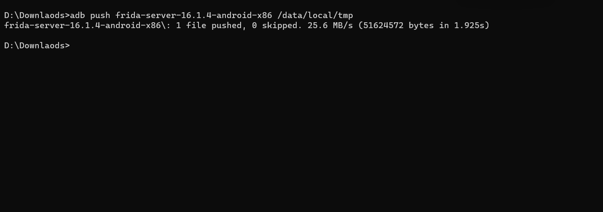

Now navigate into the `tmp` directory. To get a shell inside the device, you can use `adb shell`.

```
D:\Downlaods> adb shell
generic_x86:/ # cd /data/local
local.prop  local/
generic_x86:/ # cd /data/local/tmp/
generic_x86:/data/local/tmp # ls
frida-server-16.0.19-android-x86  frida-server-16.1.4-android-x86  lldb-server  perfd  start_lldb_server.sh
generic_x86:/data/local/tmp #

```

Let's grant executable permission to the `frida-server` binary.

```
generic_x86:/data/local/tmp # chmod +x frida-server-16.1.4-android-x86
```

Now let's run the server.

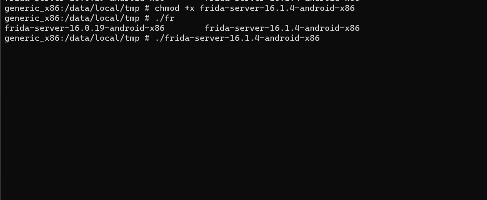

It's running fine. If you encounter any errors, I recommend trying a  Google search for solutions. Additionally, you can check the git repository for known issues and potential fixes.

## Basic usage Frida

If you want to retrieve a list of packages installed on your device, you can use the following command,

```
 frida-ps -Uai
```

- `frida-ps`:  This displays the information about running processes on an Android device.
- `-U`: This option is used to list processes on a USB-connected device (physical device or emulator).
- `-a`: This option is used to list all processes, not just the ones owned by the current user.
- `-i`: This option is used to include details about each process, such as the process ID (PID) and the name of the process.

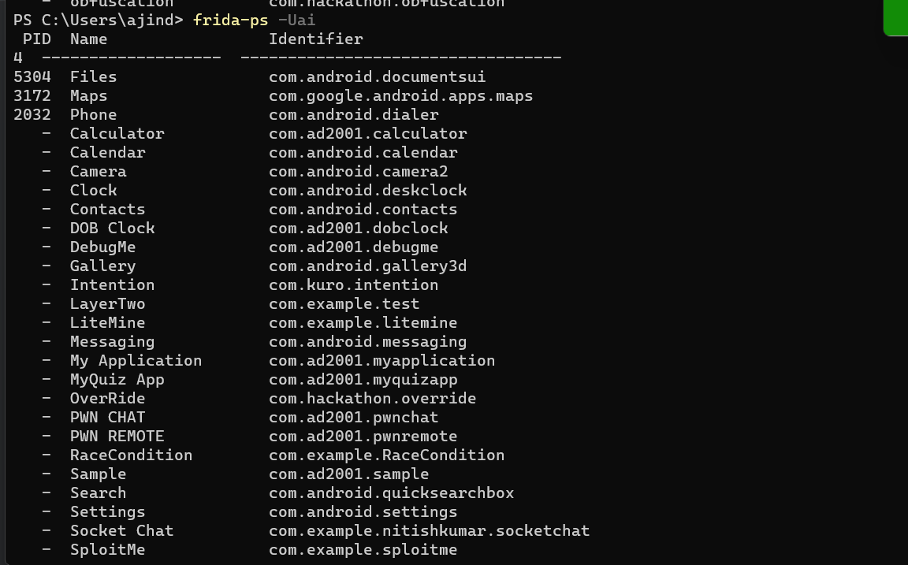

If you want to retrieve the package name of a specific application, you can use the `grep` command.

```
frida-ps -Uai | grep '<name_of_application>'
```

For attaching frida with an application we require the application package name. So after getting the package name, we can attach frida like this,

```
frida -U -f <package_name>
```

Let's see an example.

I will try to attach frida with the calculator application. The package name is `com.ad2001.calculator`.

```
frida -U -f com.ad2001.calculator
```

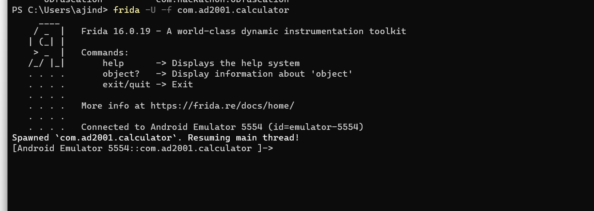

Let's take look at the emulator.

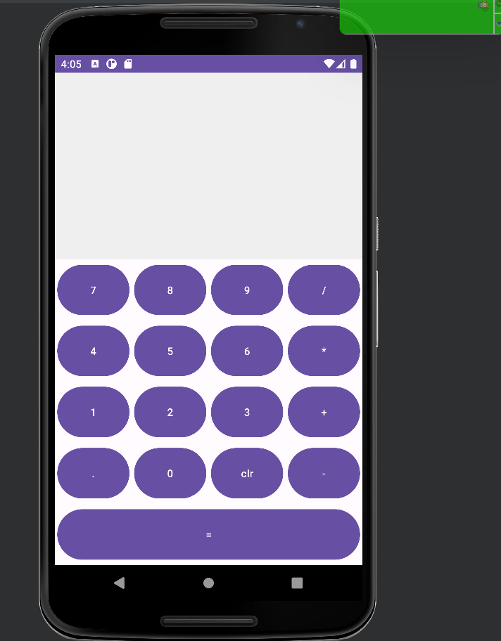

Frida launched the specified application in our device. Now that the application has been spawned, and Frida is attached, we can proceed with our dynamic instrumentation.

## Introduction to Hooking

Let's start with the very basics.

What's hooking ?

**Hooking** refers to the process of intercepting and  modifying the behavior of functions or methods in an application or the  Android system itself. For example, we can hook a method in our  application and change its functionality by inserting our own  implementation.

Now, let's attempt to hook a method in an application. We will be doing this using the JavaScript API, but it's worth noting that Frida also supports Python.

## Challenge 0x1

The application I will be using is the challenge APK itself. The  challenge is essentially a CTF-style application, and the name of the  APK is `frida 0x1`. Let's find its package name.

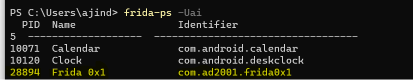

Before attaching the application to Frida, let's take a moment to  understand the application. Upon opening the application, we can see the interface below:

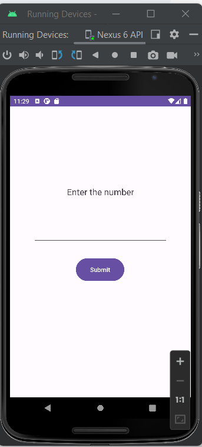


The application asks us to enter a number. Let's enter a number and see.

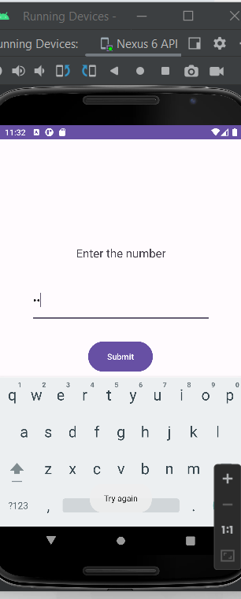


It says `Try again`.  So let's try to decompile the application using jadx.

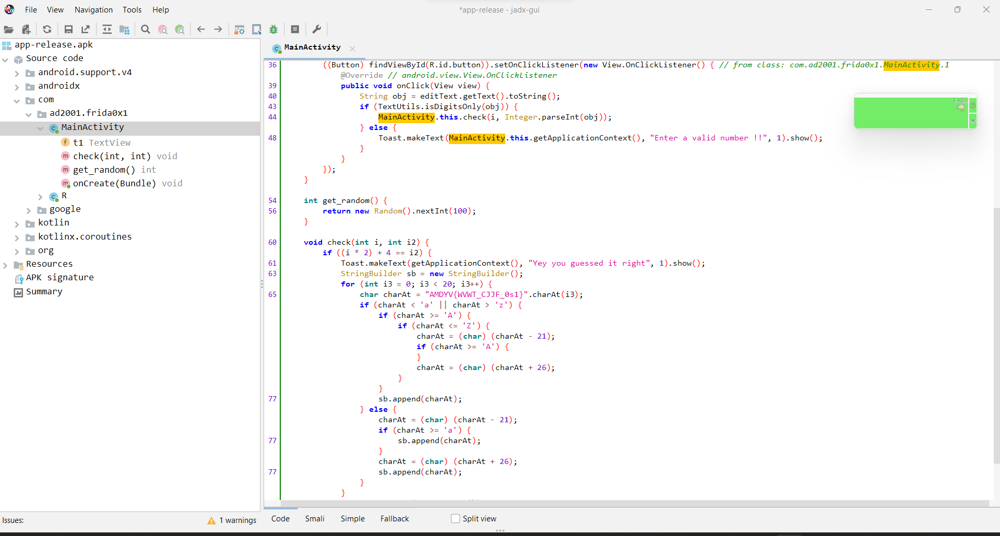

Just by skimming through the Java code, we can understand that the  application takes text input from the user, converts it into an integer, and passes that integer to a method called 'check'.

```java
public void onClick(View view) {
    String obj = editText.getText().toString();
    if (TextUtils.isDigitsOnly(obj)) {
        MainActivity.this.check(i, Integer.parseInt(obj));
    } else {
        Toast.makeText(MainActivity.this.getApplicationContext(), "Enter a valid number !!", 1).show();
    }
}
```

Along with the input number, another integer value is passed.

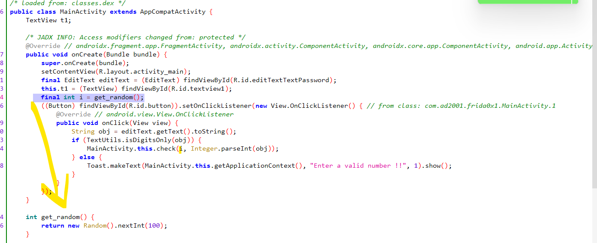

A random value is generated from the `get_random()` function when the application starts. This value falls within the range of 0 to 100 and is stored in the variable `i`. The `get_random()` function is called when the application starts, but it will be called  only once. Therefore, the random number will not change. On each run, a different random number will be generated.

Now let's see what's happening in the `check()` function.

```java
void check(int i, int i2)
```

Here `i` refers to the random number passed and `i2` refers to the parsed integer number from the input.

```java
if ((i * 2) + 4 == i2)
```

The `if` statement checks if the input number is equal to the (random value * 2 + 4). If there's a match, it decodes the hardcoded FLAG and displays it in the `textview`. To obtain the flag, we need to find the random number and perform the specified arithmetic operations, then input the result into the application.

Yes, you can easily solve it using alternative methods, but the primary goal here is to become familiar with Frida. To achieve this, we need a way to obtain the random number using Frida, and there are couple of ways to do this:

- Hooking the `get_random()` function.

  - Since we know that the random number is generated within the `get_random()` method, we can hook this method to obtain the return value, or we can overwrite the return value with an arbitrary value so that `get_random()` returns the value we provided to the `check()` function.

- Hooking the `check()` function.

  - The arguments passed to the `check()` method contains the random number. Thus, we can attempt to hook this method to retrieve the arguments and discover the random number.


Now we know how to solve this, let's try writing some frida scripts.

## Hooking a method

Firstly let me provide you a template , then i will explain it.

```javascript
Java.perform(function() {

  var <class_reference> = Java.use("<package_name>.<class>");
  <class_reference>.<method_to_hook>.implementation = function(<args>) {

    /*
      OUR OWN IMPLEMENTATION OF THE METHOD
    */

  }

})
```


- `Java.perform` is a function in Frida used to create a special context for your script to interact with Java code in Android  applications. It's like opening a door to access and manipulate the Java code running inside the app. Once inside this context, you can perform actions like hooking methods or accessing Java classes to control or observe the app's behavior.

- `var <class_reference> = Java.use("<package_name>.<class>");`

  Here, you declare a variable `<class_reference>` to represent a Java class within the target Android application. You specify the class to be used with the `Java.use` function, which takes the class name as an argument. `<package_name>` represents the package name of the Android application, and `<class>` represents the class you want to interact with.

- `<class_reference>.<method_to_hook>.implementation = function(<args>) {}`

  Within the selected class, you specify the method that you want to hook by accessing it using the `<class_reference>.<method_to_hook>` notation. This is where you can define your own logic to be executed when the hooked method is called.`<args>`represents the arguments passed to the function.

Now the next question is what will we hook ?

## Hooking the get_random() method

Let's try hooking the `get_random()` method this time. Let's write our frida script for this.

First we need the package name, we already know that.

```
com.ad2001.frida0x1
```

Next, we need to identify the class name where the method we want to hook is located.

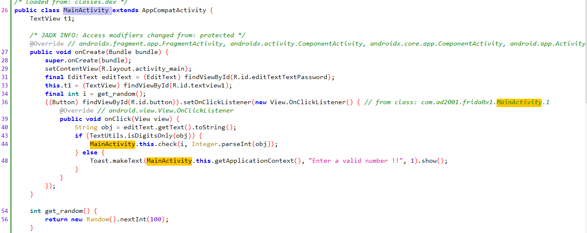

As we can see, we should get the reference to `MainActivity`.

```javascript
Java.perform(function() {

  var a= Java.use("com.ad2001.frida0x1.MainActivity");

})
```

Next, we will modify the script to include our custom implementation of the method. The method to hook is `get_random`.

```java
int get_random() {
    return new Random().nextInt(100);
}
```

```javascript
Java.perform(function() {

  var a= Java.use("com.ad2001.frida0x1.MainActivity");
  a.get_random.implementation = function(){

    console.log("This method is hooked");

  }

})
```

When we run this script, it hooks the `get_random()` function. This means that whenever the `get_random()` function is triggered, our custom code will be executed in place of the original one. In this case, when the method is triggered, it will print 'This method is hooked' The script is still not completed, and note that I'm not passing any arguments in the `function()` because `get_random()` doesn't require any.

Now, let's run the script to observe its behavior.

First, let's attach the application with Frida.

```
PS C:\Users\ajind> frida -U -f com.ad2001.frida0x1
```

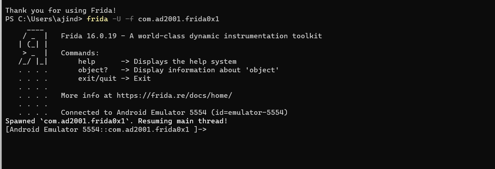

Okay, now Frida has been attached. To run the script, simply copy it and paste it into the console, like this, and then press enter.

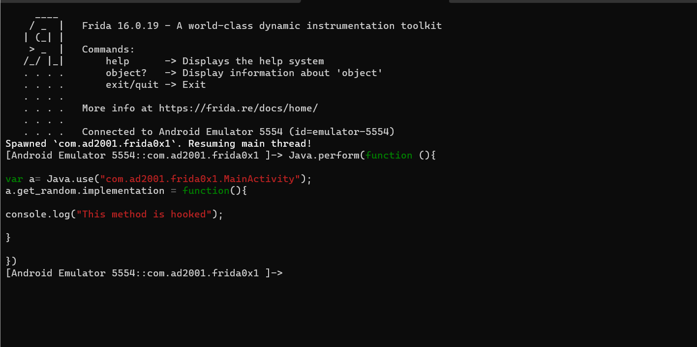

If the script has no errors, it should display as shown above. If any errors occur, Frida will alert you, and you should recheck your script.

Let's try entering a number.

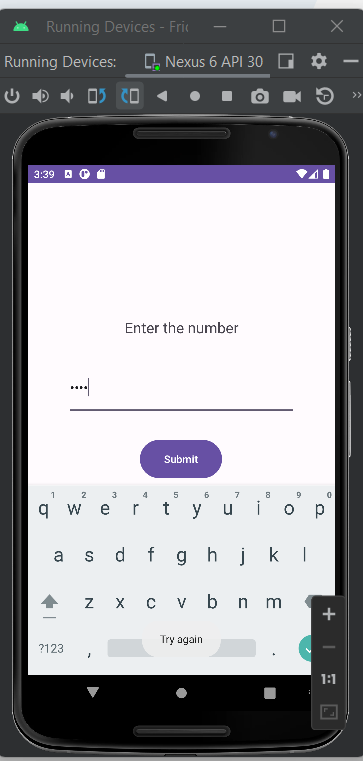

The application displays the message `Try again`. Obviously we don't know  the number. However, when we check the Frida console, we don't see any information or output.

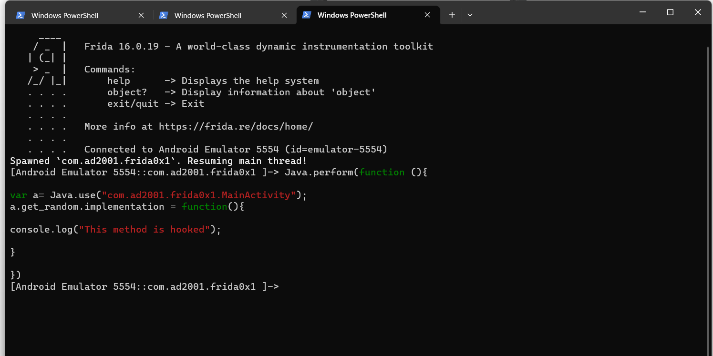

The reason for this is that the `get_random()` function is executed when the app is launched. We are injecting the script after the `get_random`() has already been executed. If you look at decompilation we can understand that.

So what will we do ?

We need to inject the script at the same time as the application loads, allowing us to hook this method before it gets executed. To do this we can use the `-l` option.  Firstly let's save our script to a file.

I saved my script as `script.js`. Now let's load this script using the `-l` option.

```
frida -U -f com.ad2001.frida0x1 -l .\script.js
```

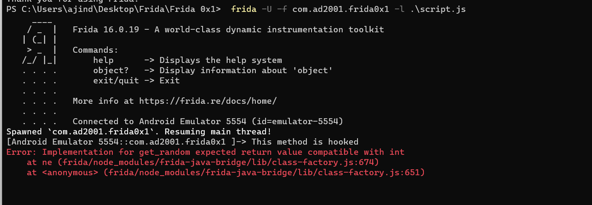

We have successfully hooked the `get_random()` method but we getting an error. It says that `get_random()` expected a return value. If we look at the implementation of `get_random()` it returns a number.

```java
int get_random() {
    return new Random().nextInt(100);
}
```

In our script, we replaced the original implementation of the `get_random()` method with our custom one, but we did not provide a return value. This return value is assigned to the `i` variable and is used in the `check()` function. So, let's try providing a return value. You can use any value.

```javascript
Java.perform(function() {

  var a= Java.use("com.ad2001.frida0x1.MainActivity");
  a.get_random.implementation = function(){

    console.log("This method is hooked");
    console.log("Returning 5")

    return 5;

  }

})
```

I used the value 5. Now if we inject this code, the `get_random()` function will return `5` every time.

Let's try running the script.

```
frida -U -f com.ad2001.frida0x1 -l .\script.js
```

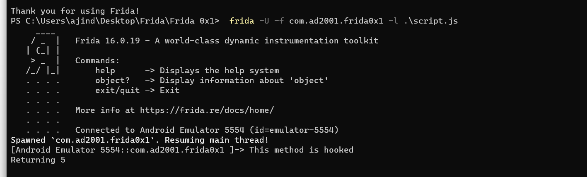

We can see that no errors are being raised here; the method was called and returned the value `5`.

Now, `5` will be passed to the `check()` function. Let's calculate the value so that we can satisfy the `if` check and obtain the flag.

```java
if ((i * 2) + 4 == i2)
```

So, 5 * 2 + 4 equals 14. If we enter 14 in the input, we can obtain the flag. Let's try that.

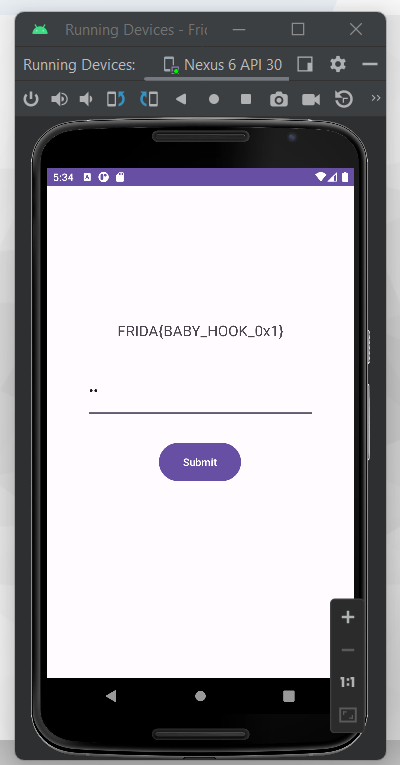

Great! We've obtained our flag.

Now, let's try to retrieve the originally generated random value. To achieve this, we need to obtain the return value from the original `get_random()` function. Let's see how to do that.

```javascript
Java.perform(function() {

  var a= Java.use("com.ad2001.frida0x1.MainActivity");
  a.get_random.implementation = function(){

    console.log("This method is hooked");
    var ret_val = this.get_random();
    console.log("The return value is " + ret_val);

  }

})
```

What we've done here is we've hooked into the `get_random()` method. Within this hook, we've called the original `get_random()` using `this.get_random()`. The`this` keyword refers to the current object. Since this method returns our original value, we've stored it in the `ret_val` variable. But if we run this script the application will crash as the `get_random` is required to provide a return value. So we can return the original value and to bypass the check we can use the original random value stored in the `ret_val` .

```javascript
Java.perform(function() {

  var a = Java.use("com.ad2001.frida0x1.MainActivity");
  a.get_random.implementation = function(){

    console.log("This method is hooked");
    var ret_val = this.get_random();
    console.log("The return value is " + ret_val);
    console.log("The value to bypass the check " + (ret_val * 2 + 4 )) // To bypass the check
    return ret_val; //returning the original random value from the get_random method

  }

})
```

Let's save and run this script.

```
frida -U -f com.ad2001.frida0x1 -l .\bypass.js
```

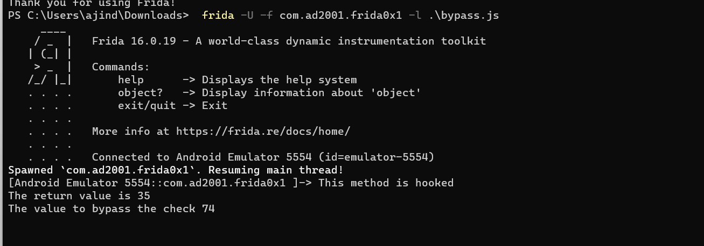

The generated random value is `35`.  Our script also calculates the value to bypass the check. So let's try entering the value `74`.

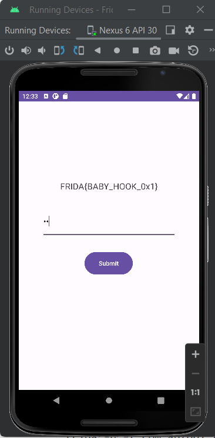

Wonderful, we got the flag.

## Hooking the check() method

Let's try the second method that I mentioned at the beginning. We will hook into the `check()` method and capture its arguments because the arguments passed to the `check()` method contain the random number.

```java
...
    final int i = get_random();
...

void check(int i, int i2) {
    if ((i * 2) + 4 == i2) {

        ...
        ...
        ...

    }
}
```

If we examine the arguments for the `check` function, the first argument, `i`, represents the random number, and the second one, `i2`, corresponds to the user-entered number. Let's capture and dump both of these arguments using Frida.

When dealing with hooking methods that have arguments, it's important to specify the expected argument types using the `overload(arg_type)` keyword. Additionally, ensure that you include these specified arguments in your implementation when hooking the method. Here our `check()` function takes two integer arguments so we can specify it like this,

```javascript
a.check.overload(int, int).implementation = function(a, b) {

  ...

}
```

```javascript
Java.perform(function() {

  var a = Java.use("com.ad2001.frida0x1.MainActivity");
  a.check.overload('int', 'int').implementation = function(a, b) { // The function takes two arguments - check(random, input)
    console.log("The random number is " + a);
    console.log("The user input is " + b);
  }

})
```

After obtaining these arguments, the primary objective is to ensure that the `check` function continues to function normally since it contains the code for generating the flag. The main goal here is to extract the random value without disrupting the overall functionality of the function. So, we can simply call the original `check()` function, as we did above with the `get_random` function. Don't forget to pass the arguments to the original `check()` call.

```javascript
Java.perform(function() {
  var a = Java.use("com.ad2001.frida0x1.MainActivity");
  a.check.overload('int', 'int').implementation = function(a, b) {
    // The function takes two arguments; check(random, input)
    console.log("The random number is " + a);
    console.log("The user input is " + b);
    this.check(a, b); // Call the check() function with the correct arguments
  }
});

```

Let's try running this script. We don't have to load this script at the beginning, as the check() function is only called when we click the button.

```
frida -U -f com.ad2001.frida0x1
```

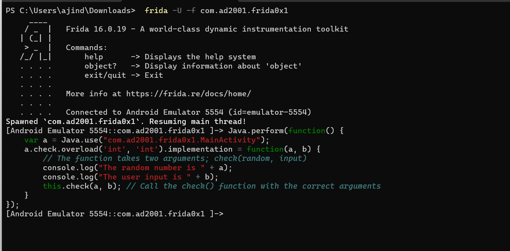

Let's enter an input and click the submit button.

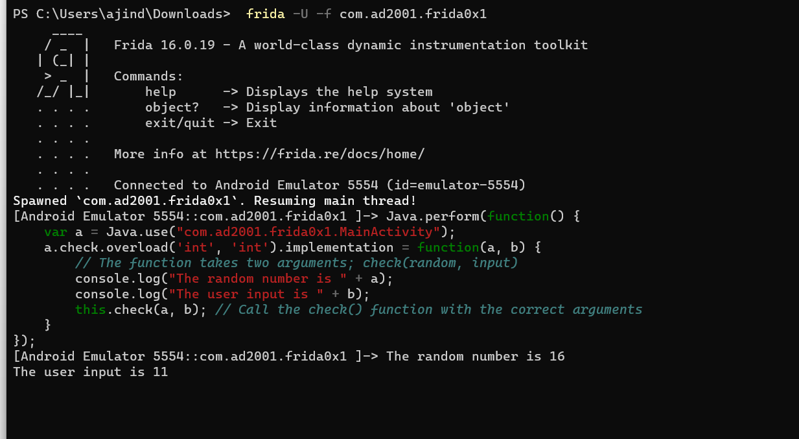

We see that the generated random number is 16. So entering (16 * 2 + 4)  `36` will give us the flag.

Before concluding this example, i want to show one more way to get the flag.

We know that to obtain the flag, our input must be equal to the result of (random number * 2 + 4). So why not simply call the `check()` function with two numbers that satisfy this condition? In this way, we don't need to concern ourselves with the random number since we are providing our own input to the `check()` function.

Let's try that. I will provide the number `4` as our input and (4 * 2 + 4) as the second argument, which equals `12`.

```javascript
Java.perform(function() {
  var a = Java.use("com.ad2001.frida0x1.MainActivity");
  a.check.overload('int', 'int').implementation = function(a, b) {
    this.check(4, 12);
  }
});

```


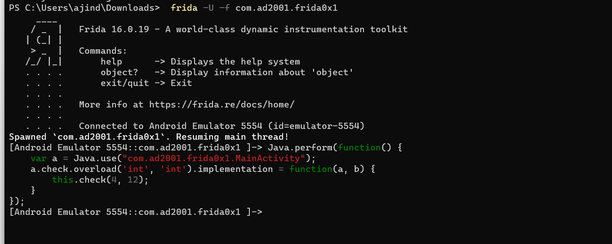

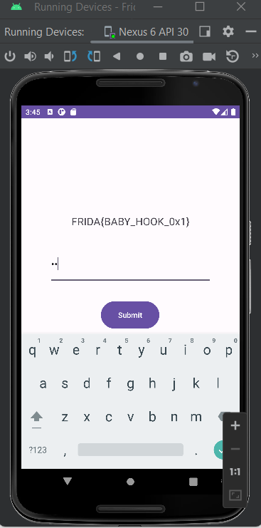

As we expected, we got the flag.

These are the very fundamentals of hooking a method in Frida and dumping its arguments and return value. Frida is a very powerful tool, and we will explore some of its major features further throughout the series.
