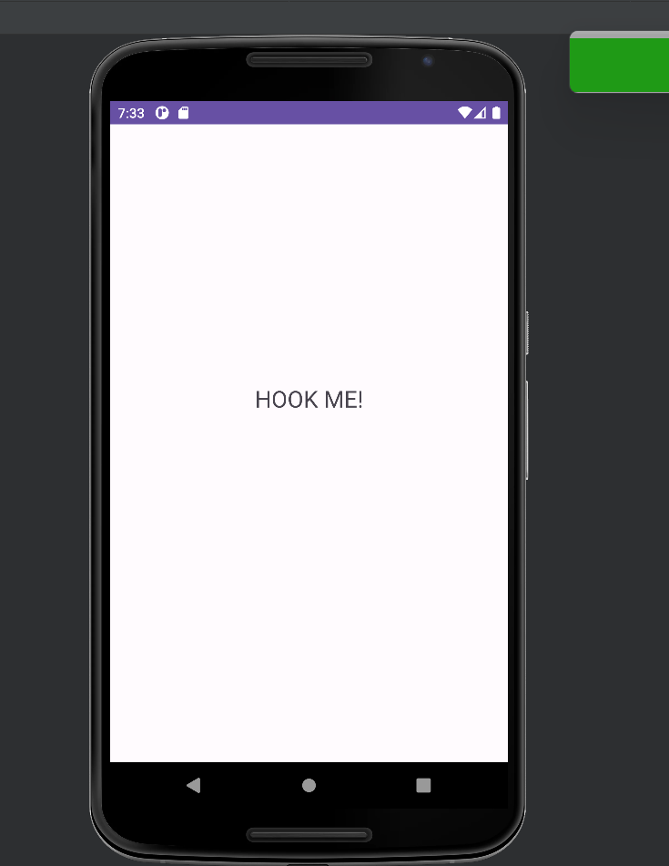
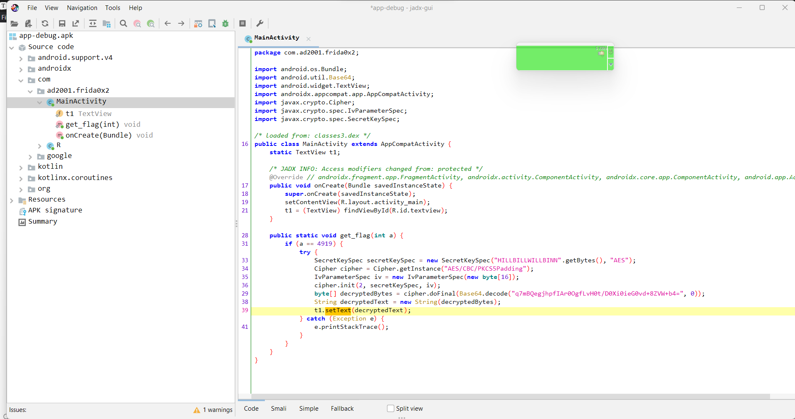
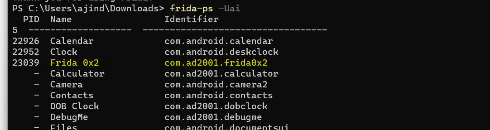
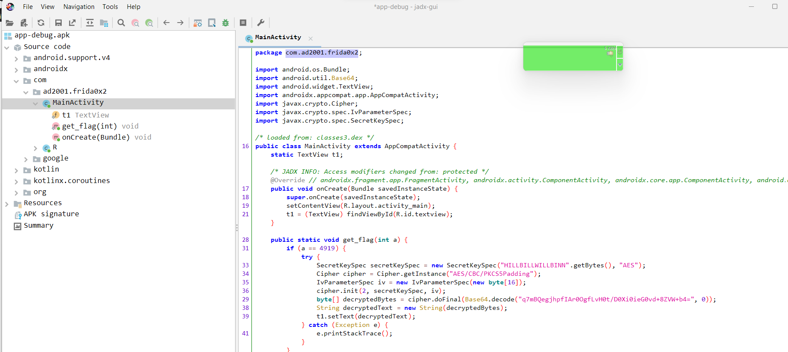
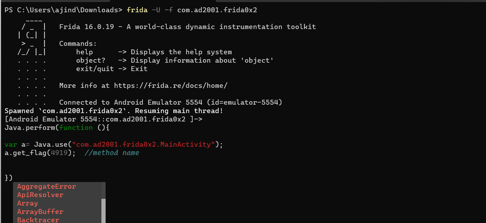
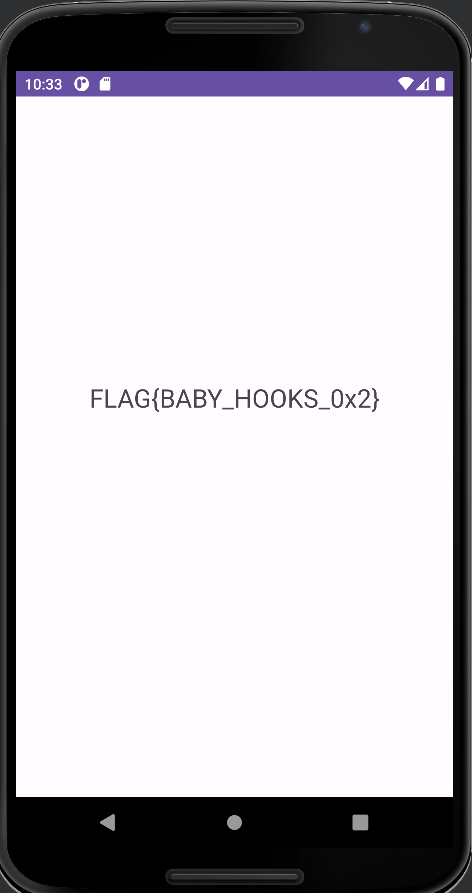

## Prerequisites

- Basics of Reverse Engineering using jadx.
- Ability to read and understand Java code.
- Capability to write small JavaScript snippets.
- Familiarity with adb.
- Rooted device.

## Challenge 0x2

Let's start with our apk. So let's install the application and take a look.




The application is quite simple,it only consists of a TextView, without any buttons or additional elements. The text displayed in the TextView reads 'HOOK ME!'. Well, that's precisely what we're going to do.

Let's use jadx to reverse engineer the application.




As we can see, it's a very small application. The only thing the application is currently doing is setting up the TextView. It's evident that our flag is within the `get_flag()` method. However, the method is not being called from anywhere. The `get_flag()` method is responsible for decrypting the flag and setting it into the TextView. From our initial observation, it's clear that AES is being used. While there are other methods to easily obtain the flag, that's not the primary goal here. There is also an `if` condition that checks if the argument variable `a` equals `4919`.

So to obtain the flag, we just need to call the `get_flag()` method. We can easily call this method using frida.

Let's start off by finding the package name of our application.



So the package name is `com.ad2001.frida0x2`. We can also find this in jadx.



Let's start writing our frida script.

```javascript

Java.perform(function() {

    var <class_reference> = Java.use("<package_name>.<class>");
    <class_reference>.<static_method>();

})
```

This is the template that we can use to call a static method. We can just use the `<class_reference>.<method>` to invoke the method.

```javascript

Java.perform(function() {

    var a = Java.use("com.ad2001.frida0x2.MainActivity");

})
```

We got the reference to `MainActivity`, now let's call the `get_flag()` method. We also need to pass the argument in this function. To get the flag, we need to satisfy the `if` condition, and for that, we need to pass `4919` as the argument.

```javascript

Java.perform(function() {

    var a = Java.use("com.ad2001.frida0x2.MainActivity");
    a.get_flag(4919);  // method name

})
```

Let's try using this script.

```
frida -U -f com.ad2001.frida0x2
```



Pressing enter will run the script. Now let's check our device.




BOOM !!  We got our flag. So this is how you can call static methods in frida.

