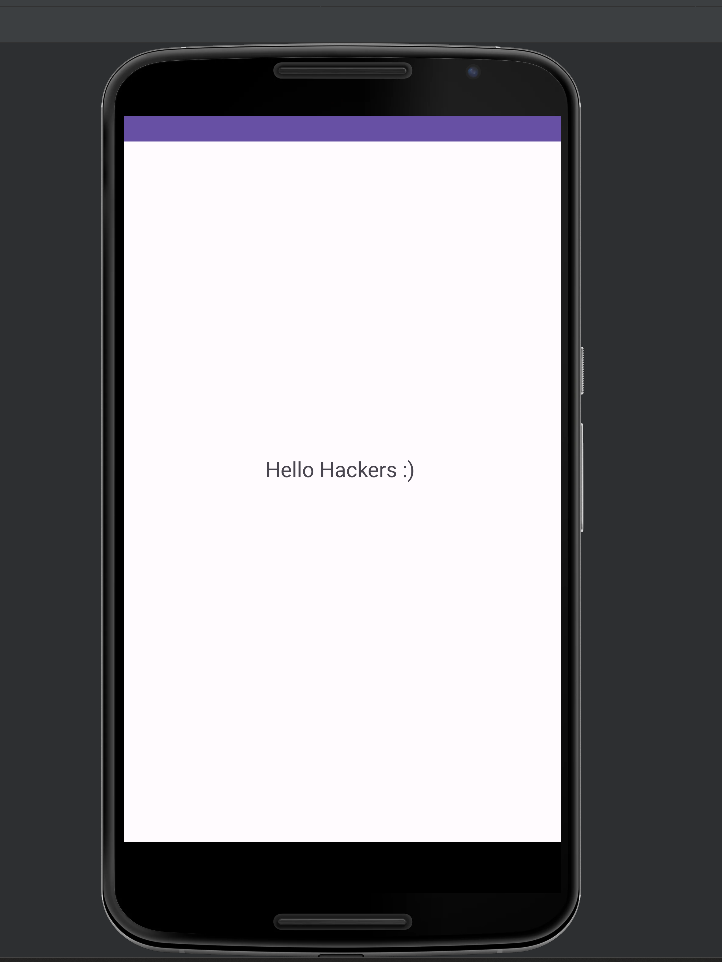
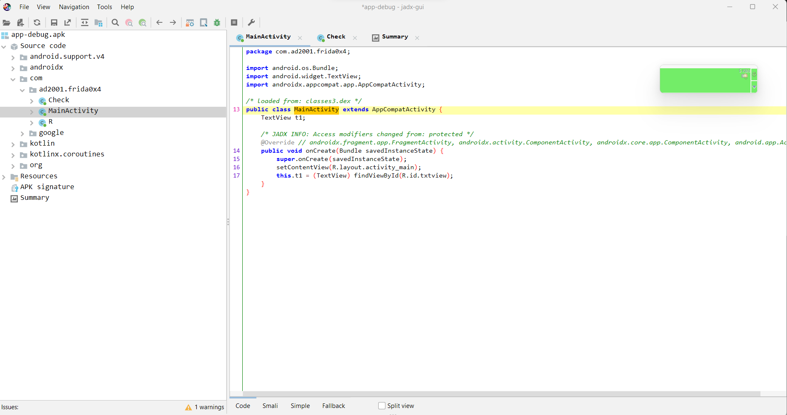
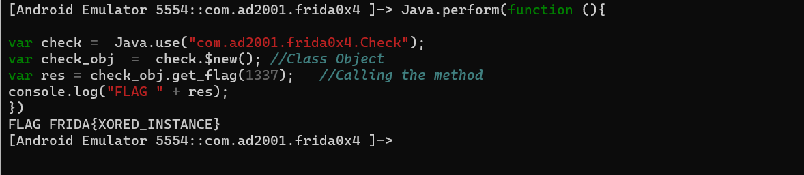

## Prerequisites

- Basics of Reverse Engineering using jadx.
- Ability to understand Java code.
- Capability to write small JavaScript snippets.
- Familiarity with adb.
- Rooted device.

## Challenge 0x4

Let's take a look at our challenge apk.



Pretty much nothing. Let's see the decompilation.



There's nothing in the `MainActivity`. Let's inspect the class `Check`.


We can see a method named `get_flag`; it's a basic XOR function that decodes the text `I]FKNtW@]JKPFA\\[NALJr` using the key `15`. While we could easily solve it, as mentioned before, our goal is to get better with Frida. As we can see, this method is not called anywhere. Also, at the start of the function, it checks if `a` is equal to `1337`. To get the flag, we can call this method and pass the value `1337` as the argument using Frida. We have done this in the previous post but it had a static method.

## Calling the get_flag()

Let's see how to call the `get_flag` method. As we know, this is not a static method, so first, we need to create an instance of the  class. Using that instance, we can then call the method. Below is the  corresponding Java code:

```java
Check ch = new Check();
String flag = ch.get_flag(1337);
```

The function will return a string, so we  should store that in a variable.

Let's see how to do this in frida.

```javascript
Java.perform(function() {

  var <class_reference> = Java.use("<package_name>.<class>");
  var <class_instance> = <class_reference>.$new(); // Class Object
  <class_instance>.<method>(); // Calling the method

})
```

In Frida, to create an instance of a Java class, you can use the `$new()` method. This is a Frida-specific method allows you to instantiate objects of a particular class.

This is the template. Let's start writing the real script.

- Package name : `com.ad2001.frida0x4`
- Class name : `Check`
- Function name : `get_flag`

```javascript

Java.perform(function() {

  var check = Java.use("com.ad2001.frida0x4.Check");

})
```

Let's create this instance using `$new()` method.

```javascript
Java.perform(function() {

  var check = Java.use("com.ad2001.frida0x4.Check");
  var check_obj = check.$new(); // Class Object

})
```

Now we can easily call the `get_flag` method.

```javascript
Java.perform(function() {

  var check = Java.use("com.ad2001.frida0x4.Check");
  var check_obj = check.$new(); // Class Object
  var res = check_obj.get_flag(1337); // Calling the method
  console.log("FLAG " + res);

})
```

Let's start frida and test this.

```
frida -U -f com.ad2001.frida0x4
```



Yeyy.. We got the flag.