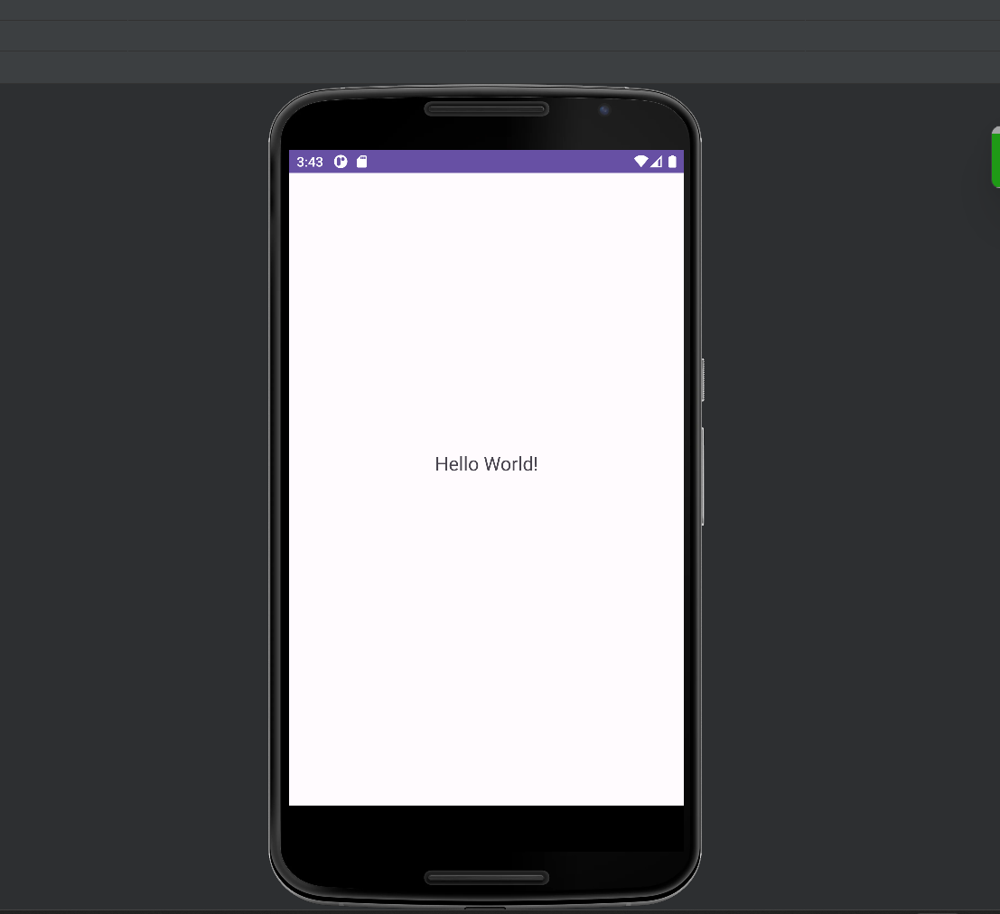
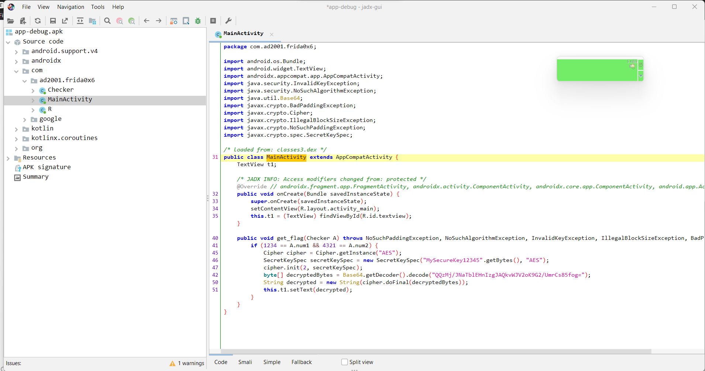
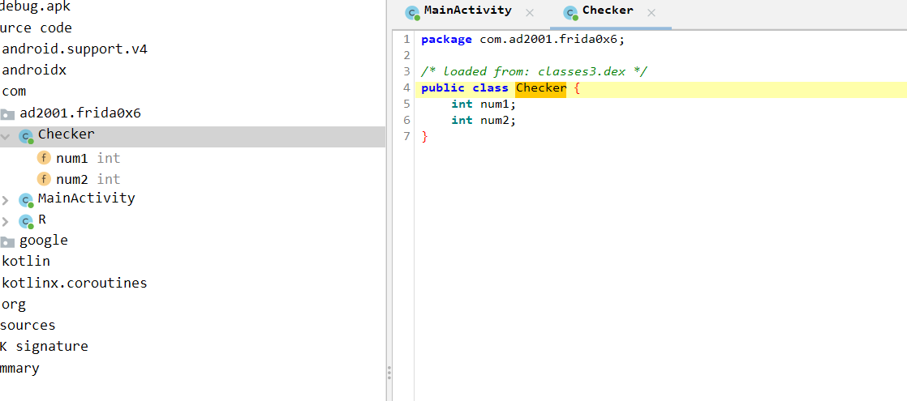
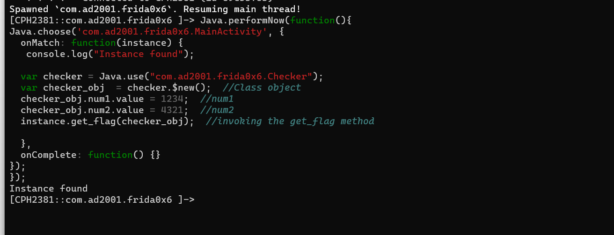

## Prerequisites

- Basics of Reverse Engineering using jadx.
- Ability to understand Java code.
- Capability to write small JavaScript snippets.
- Familiarity with adb.
- Rooted device.

## Challenge 0x6

Let's start by installing our apk and opening it.



Just like our previous challenges, there's nothing. Let's use jadx.



We have already solved a similar one before. In this case, we have a `get_flag()`  method which is not called anywhere in the application. If we call this method, it will decrypt the flag using `AES` and sets the flag in the Textview. If we examine the `get_flag` method it only takes one argument , which is an instance of the `Checker` class. The argument is named `A`, and its type is `Checker`.

```java
public void get_flag(Checker A) throws NoSuchPaddingException, NoSuchAlgorithmException, InvalidKeyException, IllegalBlockSizeException, BadPaddingException {
    // Method body
}
```

Inside the method, it checks whether `A.num1` is equal to `1234` and `A.num2` is equal to `4321`. If the condition is true, the method proceeds to decrypt an encrypted  string using AES and sets the decrypted result in a TextView . So let's examine the Checker class.



In the Checker class, we have two variables.

- num1
- num2

`num1` should be equal to `1234` and `num2` should be equal to `4321` to satisfy the `if` condition to execute the block that will decrypt and set the flag. Remember there's also no instance of this class.

## Solution

This is very easy to solve because we already did this in the previous post, the only difference is that the argument to the `get_flag` method is an object of the `Checker` class. I will conclude the steps to solve this below:

- Create a instance of the `Checker` class.
- Set `num1` to1234 and `num2` to 4321.
- Get the instance  of `MainActivity`.
- Call the `get_flag` method using the instance as the argument.

Let's start writing our frida script.

First let's create the instance of the `Checker` class.

```javascript
var checker = Java.use("com.ad2001.frida0x6.Checker");
var checker_obj = checker.$new(); // Class Object
```

Set the values of `num1` and `num2`.

```java
if (1234 == A.num1 && 4321 == A.num2) {
    ...
    ...
    ...
}
```

```javascript
checker_obj.num1.value = 1234;
checker_obj.num2.value = 4321;
```

Now let's get the instance of `MainActivity`. For this we can use `Java.performNow` and `Java.choose` APIs. We already did this in the previous challenge.

```javascript
Java.performNow(function() {
  Java.choose('com.ad2001.frida0x6.MainActivity', {
    onMatch: function(instance) {
      console.log("Instance found");

    },
    onComplete: function() {}
  });
})
```

Let's update the script with instance of the `Checker` class.

```javascript
Java.performNow(function() {
  Java.choose('com.ad2001.frida0x6.MainActivity', {
    onMatch: function(instance) {
      console.log("Instance found");

      var checker = Java.use("com.ad2001.frida0x6.Checker");
      var checker_obj  = checker.$new();  // Class Object
      checker_obj.num1.value = 1234;
      checker_obj.num2.value = 4321;

    },
    onComplete: function() {}
  });
});
```

Now the only thing left to do is to call the `get_flag` method by passing the instance of the `Checker` class.

```javascript
Java.performNow(function() {
  Java.choose('com.ad2001.frida0x6.MainActivity', {
    onMatch: function(instance) {
      console.log("Instance found");

      var checker = Java.use("com.ad2001.frida0x6.Checker");
      var checker_obj  = checker.$new();  // Class Object
      checker_obj.num1.value = 1234; // num1
      checker_obj.num2.value = 4321; // num2
      instance.get_flag(checker_obj); // invoking the get_flag method

    },
    onComplete: function() {}
  });
});
```

Let's start frida and run our script.

```
PS C:\Users\ajind> frida -U -f com.ad2001.frida0x6
```



When we check our phone, the textview will have the flag.


