## Prerequisites

- Basics of Reverse Engineering using jadx.
- Ability to understand Java code.
- Capability to write small JavaScript snippets.
- Familiarity with adb.
- Rooted device.
- Basics of x86/ARM64 assembly and reversing.

## Challenge 0x8

This apk is different than the challenges we did before. This time we are dealing with the libraries in the native space. The Android NDK (Native Development Kit) allows developers to add native code, written in languages like C and C++, into Android applications. These native codes are bundled as libraries  or shared objects (.so), allowing for the optimization of performance-critical components and providing developers with greater control over memory management. In this scenario, we will utilize Frida to perform hooking into these libraries.

Let's take a look at our application.

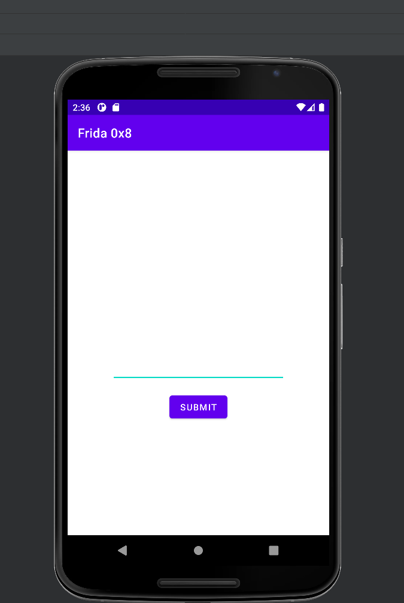

Well, we have editText, Let's input something.

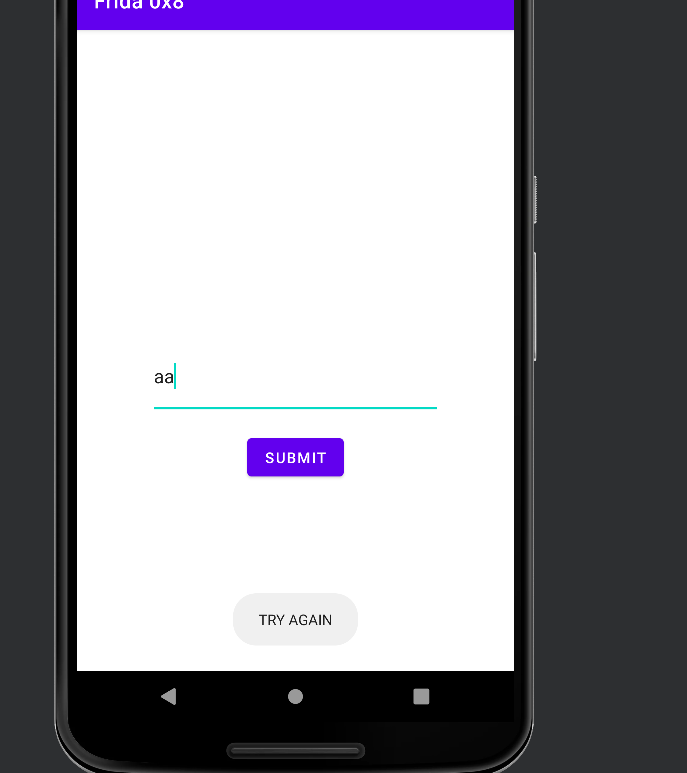

No luck. Let's see what's happening in jadx.

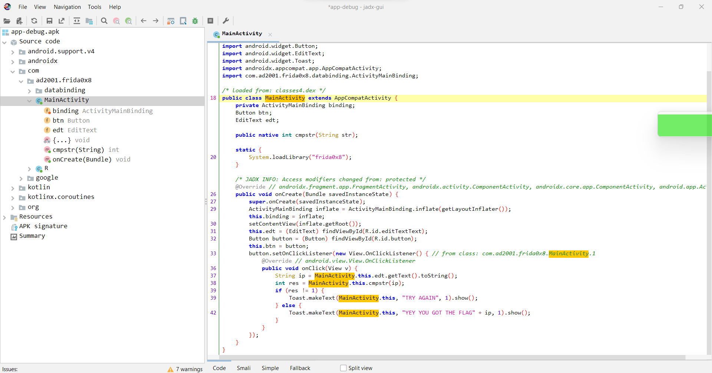

At the beginning we see the declaration of the native funtion `cmpstr`.

```java
public native int cmpstr(String str);

static {
    System.loadLibrary("frida0x8");
}
```

The `cmpstr` function takes a string as its argument and returns an integer.

It's loading the native library `frida0x8` into the memory. Let's see what's happening in the callback function of the button.

```java
button.setOnClickListener(new View.OnClickListener() { // from class: com.ad2001.frida0x8.MainActivity.1
    @Override // android.view.View.OnClickListener
    public void onClick(View v) {
        String ip = MainActivity.this.edt.getText().toString();
        int res = MainActivity.this.cmpstr(ip);
        if (res == 1) {
            Toast.makeText(MainActivity.this, "YEY YOU GOT THE FLAG " + ip, 1).show();
        } else {
            Toast.makeText(MainActivity.this, "TRY AGAIN", 1).show();
        }
    }
});
```

We can see that in the callback function, the application calls a method named `cmpstr` with the text from the EditText and returns an integer value. Another important thing is that our input is the flag itself. So let's conclude what we know so far.

- The application dynamically loads a library named `frida0x8` into memory at runtime.
- The input is the flag itself.
- This input is then passed to a function called `cmpstr` within the `frida0x8` library.
- If the return value is 1, we will get the flag.

Let's now examine the `frida0x8` library.

We can see where the library is at in jadx. It's under `/resources/lib/`.

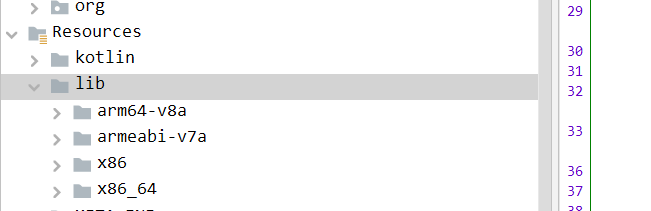

I will be working with the `x86` library, even though the majority of physical devices are based on ARM64 architecture. I will be using the emulator in Android Studio, but there won't be that much of a difference.


We can dump this library using [apktool](https://apktool.org/).

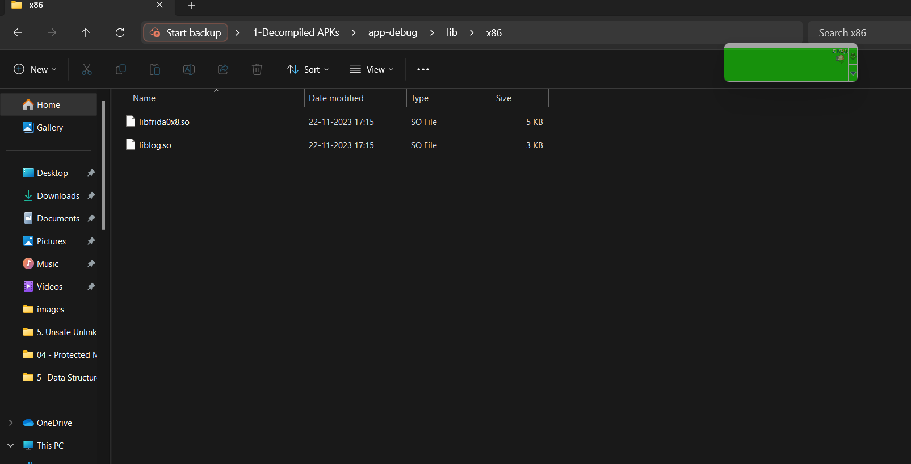

We can see our two libraries here, but we are only interested in `frida0x8`, which is renamed to `libfrida0x8.so`. By convention `lib` is prefixed with library files. The `.so` extension stands for shared object. Select the library file corresponding to your architecture,

To reverse engineer and analyze this libfrida.so file we will be using a tool called ghidra. You can use other tools like IDA,radare, Hopper, etc. but I will be using Ghidra as it's free and open source. it is a software reverse engineering (SRE) framework developed by  the National Security Agency (NSA) and released as open-source software. It provides a set of tools and capabilities for analyzing and  understanding the functionality of compiled binaries. If this is your first time using ghidra, please go through the below video.

https://www.youtube.com/watch?v=fTGTnrgjuGA

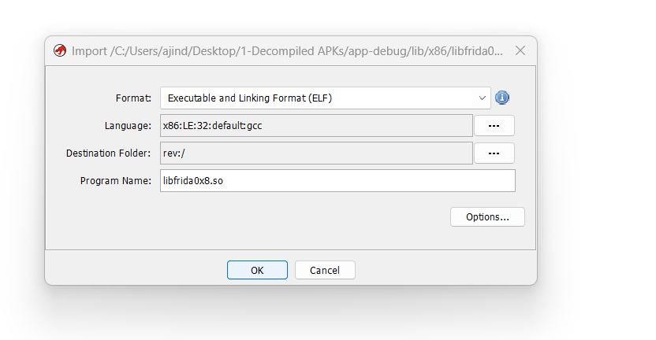

 Let's click on `ok` and continue our process.


It also identified the file signature. Let's continue by clicking `ok`.

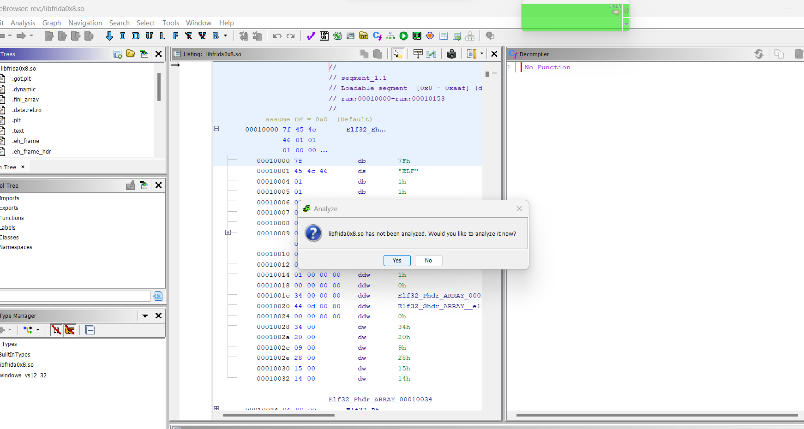


Click on `Yes` and wait till the analysis gets done.

Navigate to the left dropdown list `functions`.

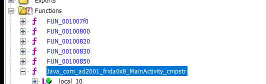

We can see our `cmpstr` compilation. Don't get confused about the name `Java_com_ad2001_frida0xa_MainActivity_cmpstr()` it's just appended with the package name . In Java, when you declare a native method, you use the `native` keyword to indicate that the method's implementation is provided in another language, typically C or C++. The declaration of the native method in the Java class doesn't include the implementation. it just acts as a signature that tells the Java runtime that the method will be implemented in a native language. The convention for the method name includes the package name and the class name.

Double-clicking on it will give the disassembly and decompilation of the function.

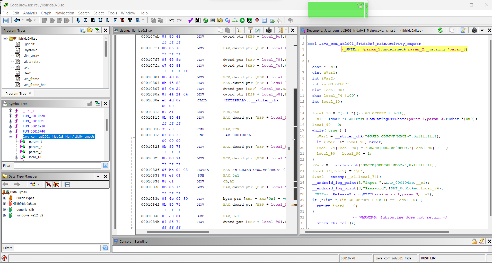

The right panel displays the decompilation. If this is your first time reversing a native library, don't worry things get easier with practice. This time i will provide the source code for the native function for the sake of explanation.

```c
#include <jni.h>
#include <string.h>
#include <cstdio>
#include <android/log.h>

extern "C"
JNIEXPORT jint JNICALL
Java_com_ad2001_frida0x8_MainActivity_cmpstr(JNIEnv *env, jobject thiz, jstring str) {
    const char *inputStr = env->GetStringUTFChars(str, 0);
    const char *hardcoded = "GSJEB|OBUJWF`MBOE~";
    char password[100];

    for (int i = 0; i < strlen(hardcoded) ; i++) {

        password[i] = (char)(hardcoded[i] - 1);
    }

    password[strlen(hardcoded)] = '\0';
    int result = strcmp(inputStr, password);
    __android_log_print(ANDROID_LOG_DEBUG, "input ", "%s",inputStr);
    __android_log_print(ANDROID_LOG_DEBUG, "Password", "%s",password);
    env->ReleaseStringUTFChars(str, inputStr);

    // Returning result: 1 if equal, 0 if not equal
    return (result == 0) ? 1 : 0;
}

```

Let me explain briefly about this.

```c
extern "C" JNIEXPORT jint JNICALL
Java_com_ad2001_frida0x8_MainActivity_cmpstr(JNIEnv *env, jobject thiz, jstring str)
```

- This declares a JNI (Java Native Interface) function named `cmpstr`.
- It's meant to be called from Java code (`Java_com_ad2001_frida0x8_MainActivity_cmpstr`).
- It takes three parameters: `env` for the JNI environment, `thiz` for the Java object, and `str` for a Java string.

```c
const char *inputStr = env->GetStringUTFChars(str, 0);
```

- Retrieves the input string from the Java string (`jstring`) and converts it to a c style string (`const char*`).

```c
const char *hardcoded = "GSJEB|OBUJWF`MBOE~";
char password[100];
for (int i = 0; i < strlen(hardcoded); i++) {
    password[i] = (char)(hardcoded[i] - 1);
}
```

- The variable`hardcoded` contains a hardcoded value and an array `password` is also declared.
- The loop transforms each character in `hardcoded` by subtracting 1 and stores the result in the `password` array.

```c
int result = strcmp(inputStr, password);
```

- Compares the user input (`inputStr`) with the adjusted password (`password`) using `strcmp`.
- The result is stored in the variable `result`.

```c
env->ReleaseStringUTFChars(str, inputStr);
```

- Releases the resources associated with the input string.

```c
return (result == 0) ? 1 : 0;
```

- Returns 1 if the strings are equal, and 0 if they are not equal.

## Hooking the native functions

Now we have an idea about the code. Let's see how to solve this using frida. We can solve this challenge by hooking the `strcmp` function and dumping it's arguments. I will explain this later.

To hook native functions, we can use the `Interceptor` API. Now, let's see the template for this.

```javascript
Interceptor.attach(targetAddress, {
    onEnter: function (args) {
        console.log('Entering ' + functionName);
        // Modify or log arguments if needed
    },
    onLeave: function (retval) {
        console.log('Leaving ' + functionName);
        // Modify or log return value if needed
    }
});

```

- `Interceptor.attach`: Attaches a callback to the specified function address. The `targetAddress` should be address of the native function we want to hook.
- `onEnter`: This callback is called when the hooked function is entered. It provides access to the function arguments (`args`).
- `onLeave`: This callback is called when the hooked function is about to exit. It provides access to the return value (`retval`).

Now the next question is how to get the address of a particular function in frida, there are plenty of ways to do that.  Let me show you some API's to do this.

- Using the frida API : `Module.enumerateExports()`
- Using the frida API :  `Module.getExportByName()`
- Using the frida API : `Module.findExportByName()`
- Calculate the offset and `add()` it to the  `Module.getBaseAddress()` address
- Using the frida API : `Module.enumerateImports()`

So before that what are these exports and imports ?

Exports refer to the functions or variables a library provides for  external use, such as the functions we use daily in programming  languages like Python and C. Imports are functions  or variables imported by our application. For example, in our app, we import libraries like `libc.so` to access standard functions like `strcmp`.

Let's see these API's one by one. Run frida and attach to our application.

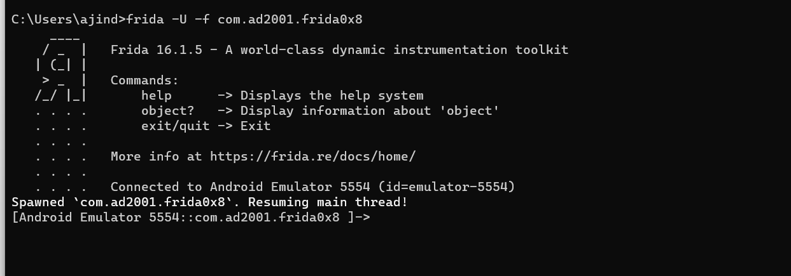

#### Module.enumerateExports()

This API enumerates all exports (symbols) from a specified module. The exported functions are used by our application in the Java space. It takes one argument, which is the name of the module (shared library or executable) for which you want to enumerate exports.

We can observe the imports and exports in the symbol tree tab in ghidra.

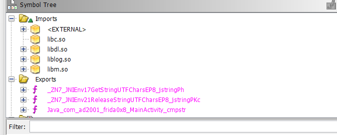

Let's try to get all the exports from  `libfrida0x8.so`.

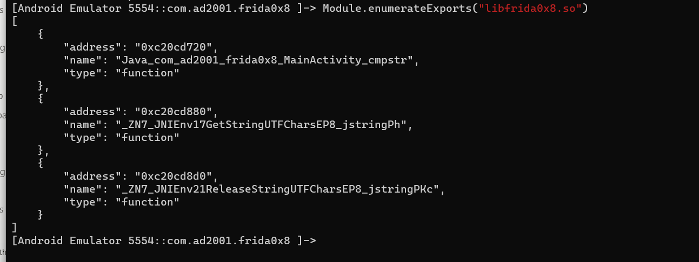

We observe the address, name, and type. Now, let's attempt to obtain the address for the `cmpstr` function. For this, we use index `0` and the key that stores the address.

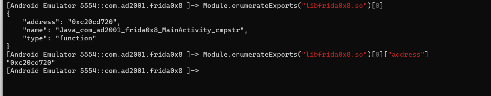

So the address is `0xc20cd720`. You shouldn't hardcode this address since it changes every time the application starts, as ASLR is enabled by default in Android.

#### Module.getExportByName()

The `Module.getExportByName(modulename, exportName)` function retrieves the address of the exported symbol with the given name from the module (shared library). If you don't know in which library your exported symbol is located, you can pass `null`. Let's use this to find the address of `cmpstr` again.

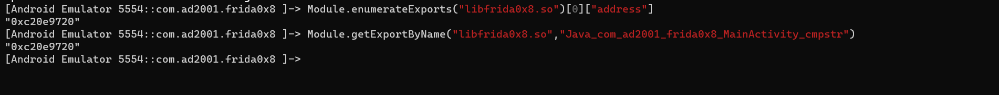

As we can see the addresses are same from the both APIs.

####  Module.findExportByName()

It's the same as `Module.getExportByName()`. The only difference is that `Module.getExportByName()` raises an exception if the export is not found, while `Module.findExportByName()` returns `null` if the export is not found. Let's see an example.

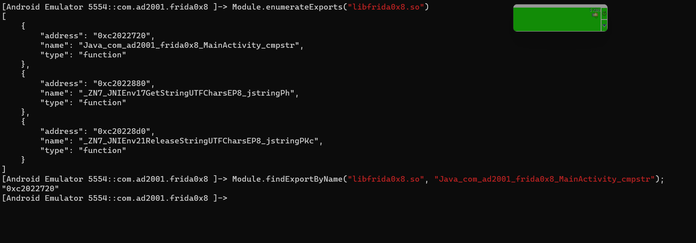

#### Module.getBaseAddress()

Sometimes if the above API's don't work we can rely on the `Module.getBaseAddress()` , This API returns the base address of the given module. Let's find the base address of the `libfrida0x8.so` library.

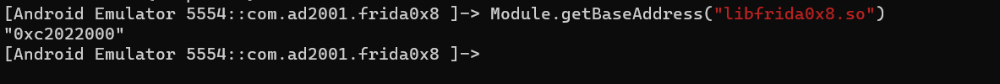

Now if we want to find the address of a specific function, we can just add the offset. To find the offset we can use ghidra. Let's find the address of `cmpstr` using this way.

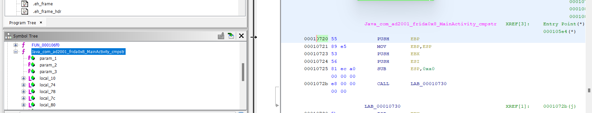

The offset is `0x720`. Ghidra loads binaries with a default base address of 0x100000, so we should subtract the base address from the offset to obtain the offset.

Adding `0x720` to   `0xc2022000` gives us `0xC2022720`.

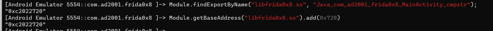

#### Module.enumerateImports()

Similar to `Module.enumerateExports()` we have the `Module.enumerateImports()`that will give us the imports of a module. Let's try this to get all the imports from `libfrida0x8.so`.

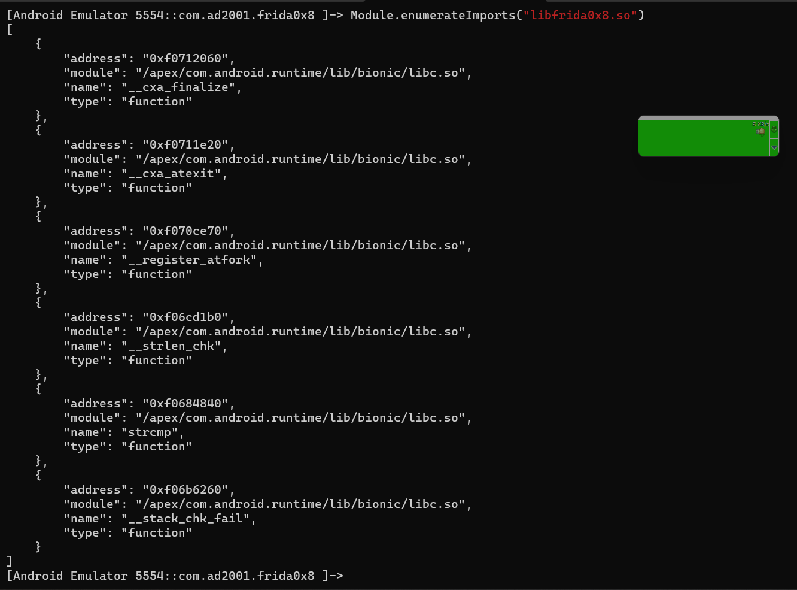

We see our `strcmp` function in the results. Let's get its address.

```
[Android Emulator 5554::com.ad2001.frida0x8 ]-> Module.enumerateImports("libfrida0x8.so")[4]['address']
"0xf0684840"
```

Okay now we are familiar with these API's let's move on to solving this challenge.

As we have already examined the source code/pseudo-code, we know that the string from the `EditText` is compared with another string using the `strcmp()` function. We also understand that the flag is our input itself. Therefore, the best approach is to hook the `strcmp` function so that we can observe the string with which our input is being compared. The `strcmp` function has two arguments; both are pointers to the strings to be compared. We can try to dump its arguments. Remember different architectures have distinct calling conventions and has different registers. Also try examining the disassembly to understand more.

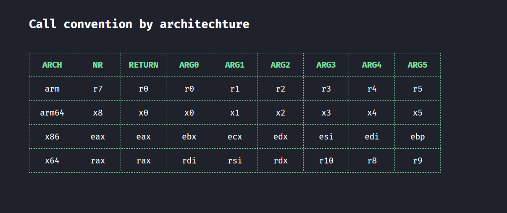

This table is taken from https://syscall.sh/.

Anyways, let's start writing our script for hooking `strcmp`.

```javascript
Interceptor.attach(targetAddress, {
    onEnter: function (args) {
        // Modify or log arguments if needed
    },
    onLeave: function (retval) {
        // Modify or log return value if needed
    }
});

```

First, let's find the address for `strcmp`. You can use any of the APIs I mentioned above. I will be using `Module.findExportByName()`.  We know the c functions like `strcmp` are in the `libc.so` library and is exported.

```
[Android Emulator 5554::com.ad2001.frida0x8 ]-> Module.findExportByName("libc.so", "strcmp");
"0xf0684840"
```

Now let's store that in a variable and edit the target address.

```javascript
var strcmp_adr =  Module.findExportByName("libc.so", "strcmp");
Interceptor.attach(strcmp_adr, {
    onEnter: function (args) {
        // Modify or log arguments if needed
    },
    onLeave: function (retval) {
        // Modify or log return value if needed
    }
});
```

Now let's add a `console.log` to see if this is working properly.

```javascript
var strcmp_adr =  Module.findExportByName("libc.so", "strcmp");
Interceptor.attach(strcmp_adr, {
    onEnter: function (args) {

      console.log("Hooking the strcmp function");

    },
    onLeave: function (retval) {
        // Modify or log return value if needed
    }
});
```

Let's start frida and test this code.

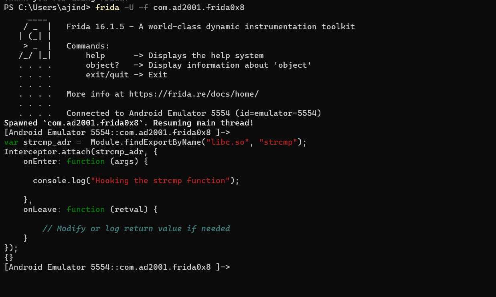

Now let's trigger the `strcmp` function by clicking the button in the app.

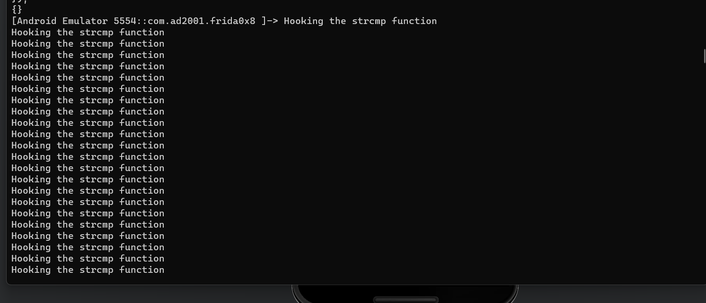

It worked, but it's printing the log message many times.

This is happening because we have hooked into every `strcmp` in the application, and we don't want this.  Let's fix this. We know that in `strcmp`, one string will be our input, right? So, we can provide a specific string and use it as a filter to apply the hook. However, we still don't know whether our input is the first or the second argument. Looking at the decompilation in ghidra gives a hint that it's the first argument, or we could find it through trial and error. So let's try to filter using the first argument.

For reading a string from the memory using frida. We can use `Memory.readUtf8String()` API. It reads a `utf` string from the memory using the provided address. The `args` is an array of pointers that contains the arguments for the `strcmp` function. So to access the first argument we can use `arg[0]`.

```javascript
var strcmp_adr = Module.findExportByName("libc.so", "strcmp");
Interceptor.attach(strcmp_adr, {
    onEnter: function (args) {
        var arg0 = Memory.readUtf8String(args[0]);
    },
    onLeave: function (retval) {
        // Modify or log return value if needed
    }
});

```

Now let's add an `if` condition and the `include` function to filter our `strcmp`.

```javascript
var strcmp_adr = Module.findExportByName("libc.so", "strcmp");
Interceptor.attach(strcmp_adr, {
    onEnter: function (args) {
        var arg0 = Memory.readUtf8String(args[0]);
        if (arg0.includes("Hello")) {

            console.log("Hookin the strcmp function");

        }
    },
    onLeave: function (retval) {
        // Modify or log return value if needed
    }
});

```

This will check if the first argument includes the string `Hello`.if yes, it will print the log message.

Restart frida and enter `Hello` in our editText and trigger the `strcmp` by clicking the button.  Always restart frida when hooking native functions.

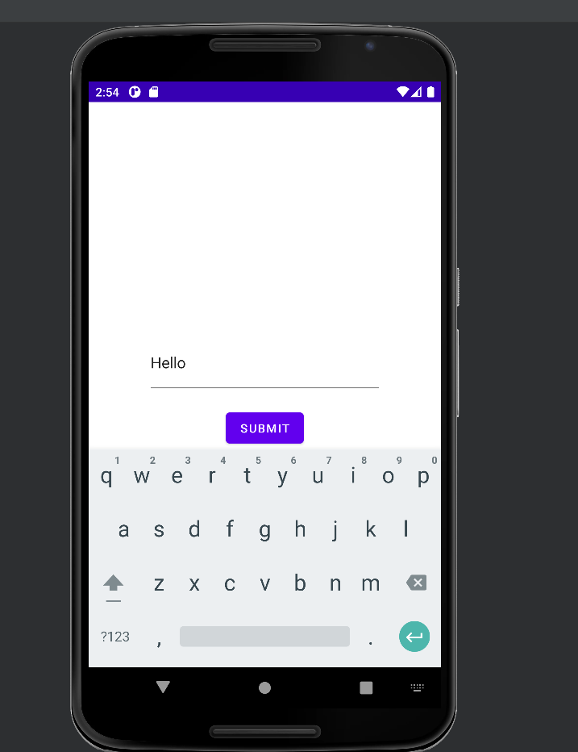

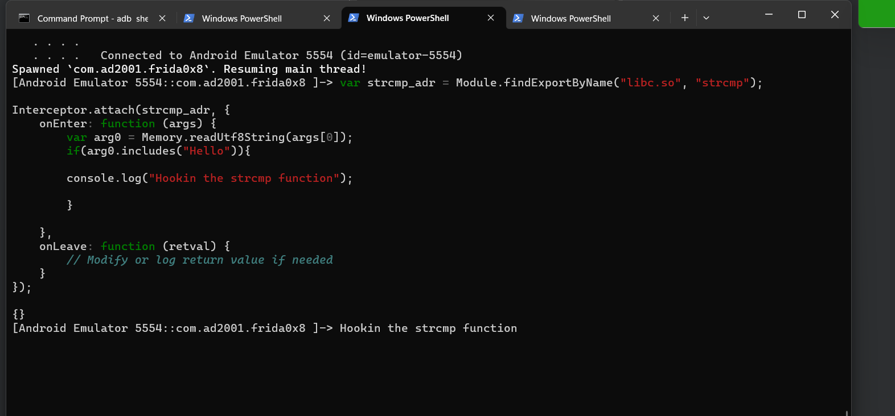

As we can see, now it's printing only one log message.

Now, the only thing left to do is to print the second argument. The  second argument is our flag, which is compared with our input. Let's update the script.

```javascript
var strcmp_adr = Module.findExportByName("libc.so", "strcmp");
Interceptor.attach(strcmp_adr, {
    onEnter: function (args) {
        var arg0 = Memory.readUtf8String(args[0]); // first argument
        var flag = Memory.readUtf8String(args[1]); // second argument
        if (arg0.includes("Hello")) {

            console.log("Hookin the strcmp function");
            console.log("Input " + arg0);
            console.log("The flag is "+ flag);

        }
    },
    onLeave: function (retval) {
        // Modify or log return value if needed
    }
});

```

Let's run it.

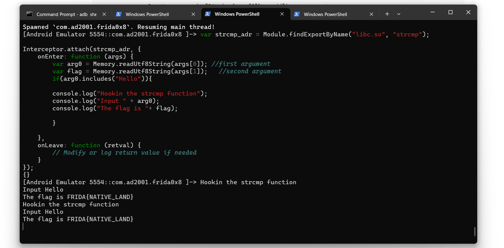

Woah we got the flag.

Let's input this in our app and see.

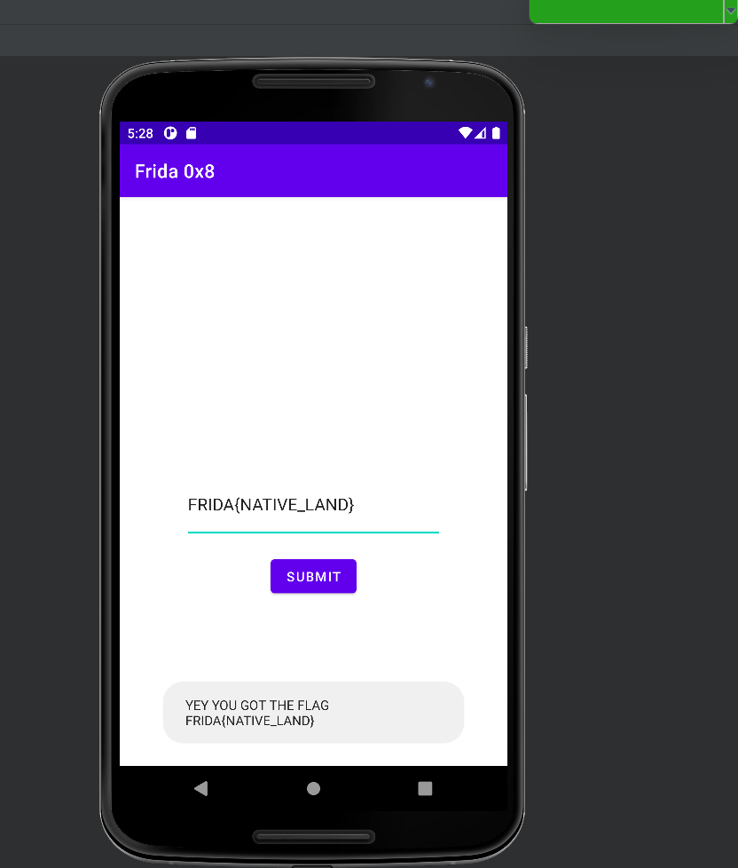


So this is how you can use frida to hook functions in the native space. We will using this in the next couple of challenges.
