## Prerequisites

- Basics of Reverse Engineering using jadx.
- Ability to understand Java code.
- Capability to write small JavaScript snippets.
- Familiarity with adb.
- Rooted device.
- Basics of x86/ARM64 assembly and reversing.

## Challenge 0xB

The main goal of this challenge is to introduce temporary patching instructions with frida. So let's install and open the application.

 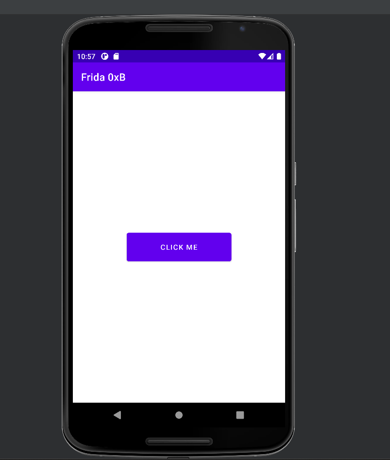

Nothing much. Clicking the button doesn't output anything. Let's use jadx.


At the start of the decompilation, we can see the declaration of a native function `getFlag()`.

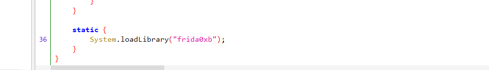

At the bottom, we can see that the application loads `frida0xb.so` using `System.loadLibrary()`.

In the `onCreate` method, it calls the `getFlag()` method in the native function. It doesn't take any arguments, nor does it return anything.

Now let's analyze this library file using ghidra. First decompile the apk with anytool you prefer then select the library for your architecture. I will be examining the `x86` library as my emulator is based on `x86`.

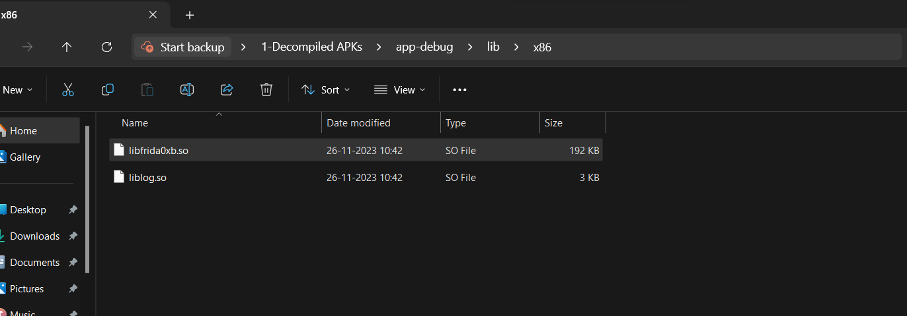

Now let's load the `libfrida0xb.so` file into ghidra.

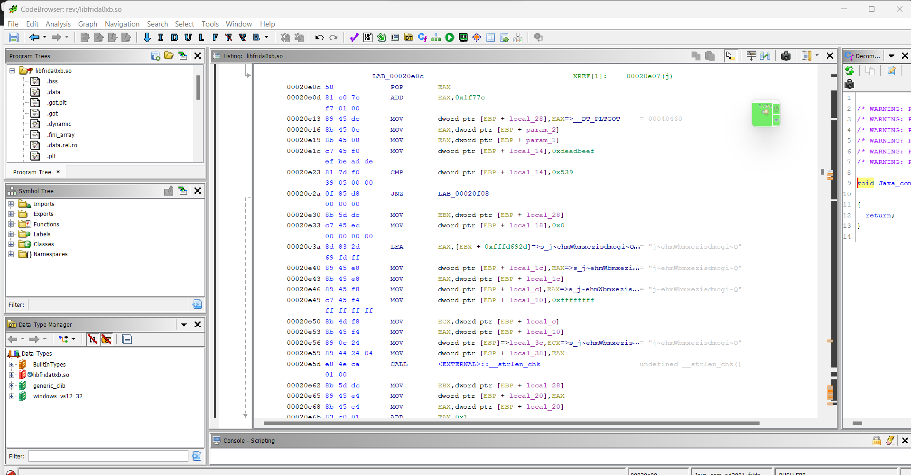

Now let's examine the `getFlag()` function.


If we check the decompilation, it doesn't make any sense.

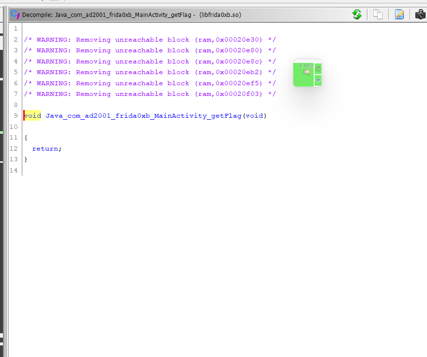

But if you check the disassembly, we can see why the decompilation is like this.

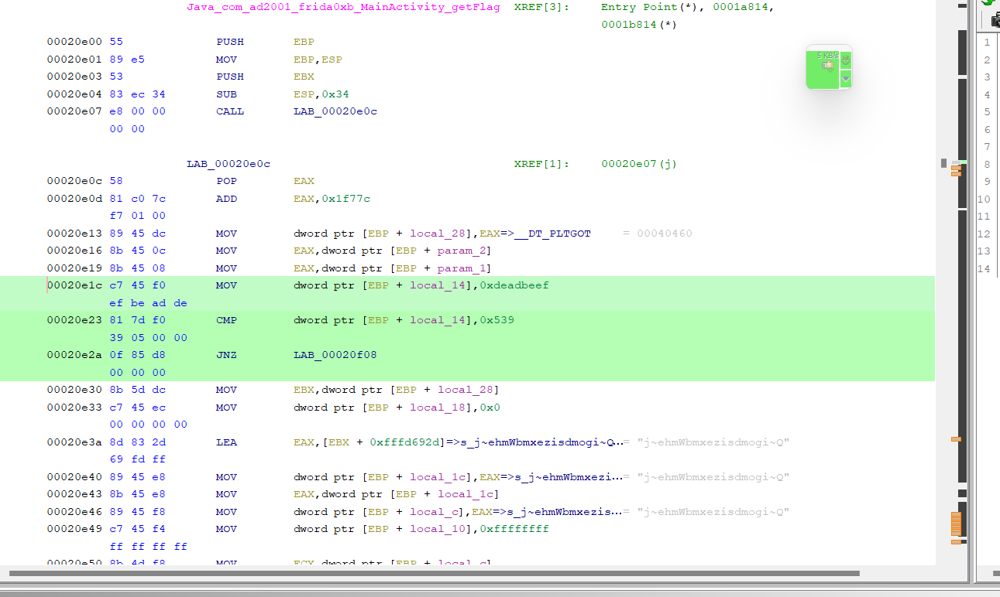

First, it loads the value `0xdeadbeef` into a local variable `local_14` then, it compares it with `0x539`. We know that they are not equal. The block of code below is executed only if this condition is satisfied. Therefore, ghidra optimized its decompilation because that comparison will never be true.  You can use the graph option get a better idea.


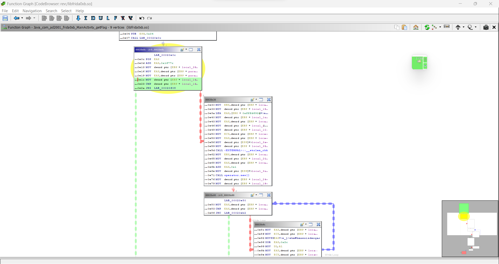

So to get the decompilation, we can disable the optimization in ghidra. Go to the `Edit` option -> `Tools Options`.

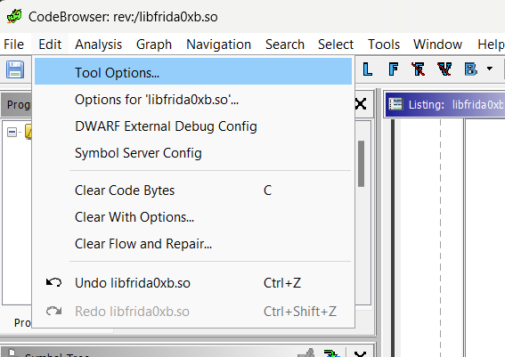

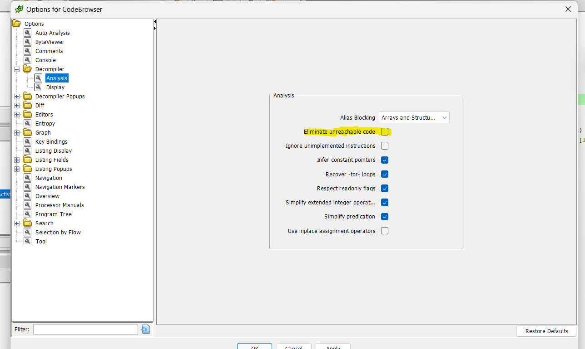

Untick the `Eliminate unreachable code`. Click on Apply. Now let's check the decompilation.

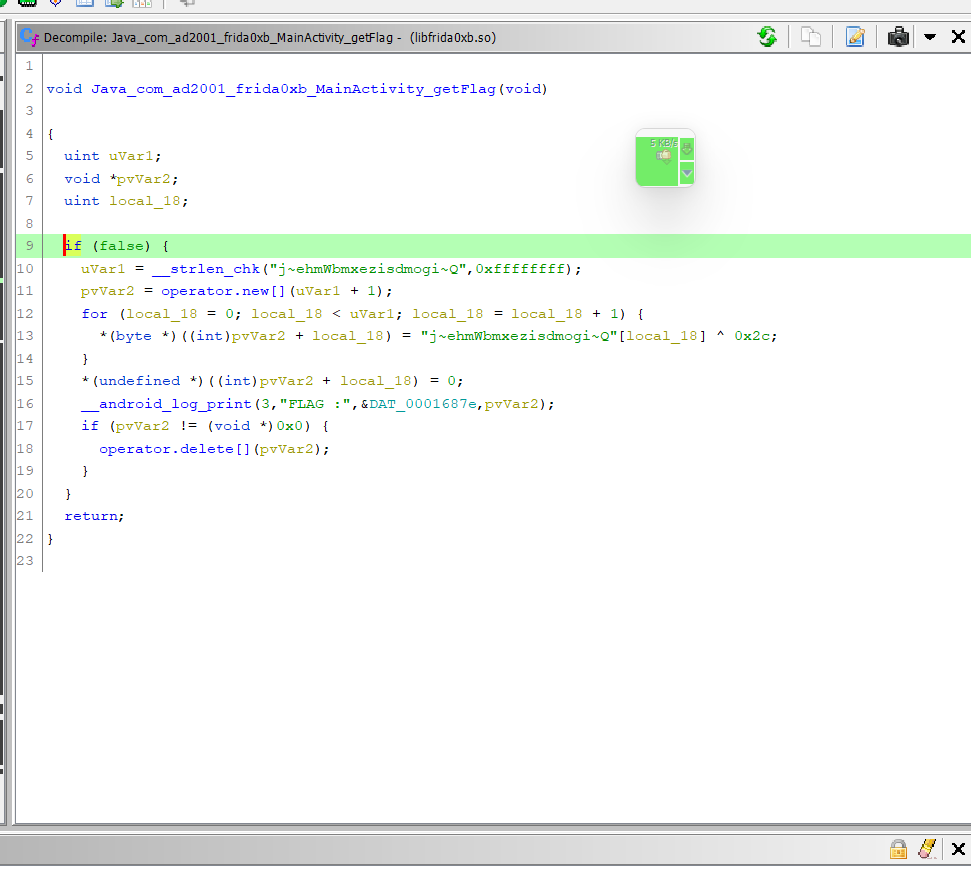

Even though it doesn't give us 100% accurate decompilation, it provides us with an idea. The `if(false)` part should be like `if (local_14 == 1337)`, where `local_14` is `0xdeadbeef`. Further inspecting the code, we can understand that it's decoding a string, `j~ehmWbmxezisdmogi~Q`, using the XOR operation. The key is `0x2c`. After the string is decoded, it logs the flag.

So the question is how to get the flag ?

The function is called when the button is clicked. But as the `if` check is never true, we won't get the flag.

What if we patch these instructions so that we can bypass the check and execute the block of code that decodes and logs the flag? That would be interesting, right? We will be doing exactly that. For modifying / temporarily patching instructions we can use the `X86Writer` class for x86 architecture and `Arm64Writer` class for ARM64 architecture.

As I'm using `x86` i will be using the `X86Writer`. Let's see a basic template for this.

```javascript

var writer = new X86Writer(<address_of_the_instruction>);

try {
  // Insert instructions

  // Flush the changes to memory
  writer.flush();

} finally {
  // Dispose of the X86Writer to free up resources
  writer.dispose();
}

```

**Instantiation of `X86Writer`:**

- `var writer = new X86Writer(<address_of_the_instruction>);`
- This creates an instance of the `X86Writer` class and specifies the address of the instruction we want to modify. This sets up the writer to operate on the specified memory location.

**Inserting instructions:**

- `try { /* Insert instructions here */ }`
- Within the `try` block, we can insert the x86 instructions that we want to modify/add. The `X86Writer` instance provides various methods for inserting various x86 instructions. We can use the documentation for this.

**Flushing the Changes :**

- `writer.flush();`
- After inserting the instructions, you call the `flush` method to apply the changes to the memory. This makes sure that the modified instructions are written to the memory location.

**Cleanup :**

- `finally { /* Dispose of the X86Writer to free up resources */ writer.dispose(); }`
- The `finally` block is used to make sure that the `X86Writer` resources are cleaned up properly. The `dispose` method is called to release the resources associated with the `X86Writer` instance.

Now we have a rough idea about the template. Next, we have to figure out want instruction to patch/modify. This requires a bit of reverse engineering basics. Consider the below three instructions.

```assembly
        00020e1c c7  45  f0       MOV        dword ptr [EBP  + local_14 ],0xdeadbeef
                 ef  be  ad  de
        00020e23 81  7d  f0       CMP        dword ptr [EBP  + local_14 ],0x539
                 39  05  00  00
        00020e2a 0f  85  d8       JNZ        LAB_00020f08
                 00  00  00
```

First, it will load `0xdeadbeef` into `local_14`, and then it compares it with `0x539`. The `CMP` instruction sets the zero flag if both operands are the same. After this `CMP` instruction, we have a `JNZ` instruction. This instruction (Jump Not Zero) will change the execution flow to the specified address if the zero flag is not set. If the zero flag is set, it will not jump and will continue executing the next instruction.  But unfortunately in this case, as `0xdeadbeef` doesn't equal to `0x539`, zero flag won't be set and the `JNZ`	instruction will jump to the address `0x00020f08` which is the end of the function.

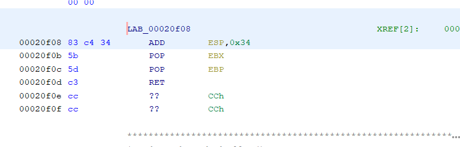

We want the application not to take the jump so that the execution  continues to the next instructions, decodes, and logs our flag. So we can patch the `JNZ` instruction so that it doesn't take the jump. We can replace the `JNZ` with a `NOP` instruction. `NOP` stands for no-operation. It doesn't do anything other than passing the execution to the next instruction. By substituting `NOP` in place of `JNZ`, the execution will continue without jumping, and logs the flag. You can also try other instructions like `JE`, which is like the opposite of `JNZ`.

Okay, now we have the idea let's see how to use the `X86Writer` to solve our challenge.

## Patching using X86Writer

Let's start by finding the address of the `JNZ` instruction we want to patch.

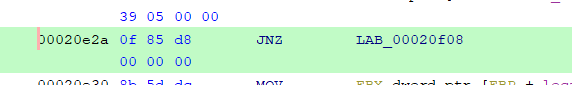

We can find the offset by subtracting `0x20e2a` with the base `0x00010000`. Now to get the actual actress we can use add this offset with the base address.

```
[Android Emulator 5554::com.ad2001.frida0xb ]-> Module.getBaseAddress("libfrida0xb.so")
"0xc2083000"
```

```
[Android Emulator 5554::com.ad2001.frida0xb ]-> Module.getBaseAddress("libfrida0xb.so").add(0x20e2a - 0x00010000)
"0xc2093e2a"
```

Let's write our script.

```javascript
var jnz = Module.getBaseAddress("libfrida0xb.so").add(0x20e2a - 0x00010000);
var writer = new X86Writer(jnz);

try {

  writer.flush();

} finally {

  writer.dispose();
}
```

Now we need to place the `NOP` instruction in the place of  the `JNZ` instruction. To place a `NOP` instruction we can use the method `PutNop()`

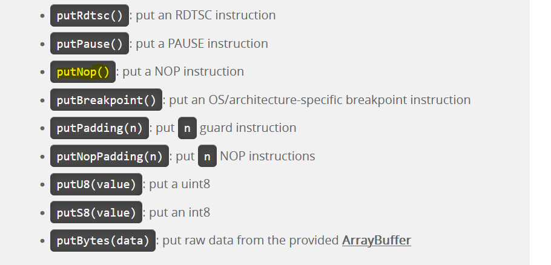

You can refer the documentation for this.

https://frida.re/docs/javascript-api/#x86writer

Before updating the script, think about this. How many `NOP` instructions should be placed here ?

The size of  a `NOP` instruction in a typical `x86` architecture is 1 byte. But you look at the size of the `JNZ` instruction we are trying to replace, it is 6 bytes.  You can find the size easily using ghidra.

```
        00020e2a 0f  85  d8       JNZ        LAB_00020f08
                 00  00  00
        00020e30 8b  5d  dc       MOV        EBX ,dword ptr [EBP  + local_28 ]

```

Subtracting `0x00020e2a` from `0x00020e30` gives us 6. In conclusion, we have to place six `NOP` instructions in the place of `JNZ` because when patching instructions with other instructions, we must  ensure that the size of the new instruction accounts for the size of the instruction that is being replaced. So let's update the script.

```javascript
var jnz = Module.getBaseAddress("libfrida0xb.so").add(0x20e2a - 0x00010000);
var writer = new X86Writer(jnz);

try {

  writer.putNop()
  writer.putNop()
  writer.putNop()
  writer.putNop()
  writer.putNop()
  writer.putNop()

  writer.flush();

} finally {

  writer.dispose();
}
```

Let's try this script now.

```
PS C:\Users\ajind> frida -U -f com.ad2001.frida0xb
```

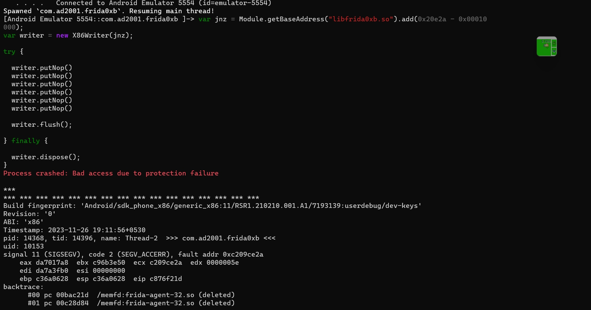

Aah, it crashed. The error says that process crashed due to protection failure.  This crash occured because, we tried to write to a memory which doesn't have write permission. We are trying to write to the `.text` section of the binary. By default it doesn't have  `write` permission. This is why it crashed. We can check this using ghidra's memory map tool.

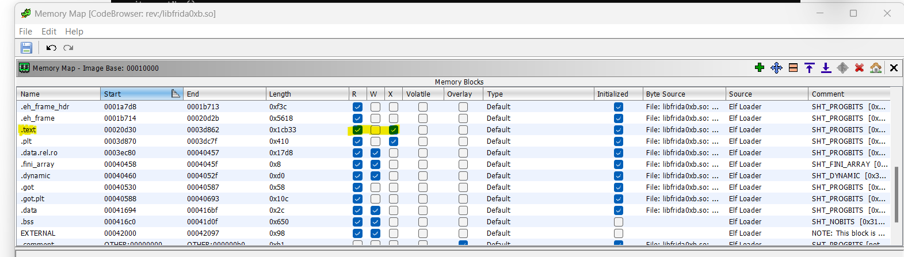

So what is the solution ?

Here comes the `Memory.protect` function. We can use this function to modify the protection attributes of a memory region. The syntax for the `Memory.protect` function is:

```
Memory.protect(address, size, protection);
```

- `address`: The starting address of the memory region to change the protection.
- `size`: The size of the memory region in bytes.
- `protection`: The protection attributes for the memory region.

We can use this function to make the `.text` section writable. We won't be making the entire section writable. We only need to change the permission for a tiny region so that we can insert the `NOP` instruction without crashing the application. In our case, we can provide the address of the `JNZ` function as the first argument for the `Memory.protect()` function. For the size, we can specify `0x1000`, it is more than enough as our `NOP` instructions take only 6 bytes. For the protection, we need read, write, and execute. So we can pass `rwx`.

```
Memory.protect(jnz, 0x1000, "rwx");
```

Let's update the script for the final time.

```javascript
var jnz = Module.getBaseAddress("libfrida0xb.so").add(0x20e2a - 0x00010000);
Memory.protect(jnz, 0x1000, "rwx");
var writer = new X86Writer(jnz);

try {

  writer.putNop()
  writer.putNop()
  writer.putNop()
  writer.putNop()
  writer.putNop()
  writer.putNop()

  writer.flush();

} finally {

  writer.dispose();
}
```

Now let's run the script.

```
PS C:\Users\ajind> frida -U -f com.ad2001.frida0xb
```

Let's also open the logcat in our android device.

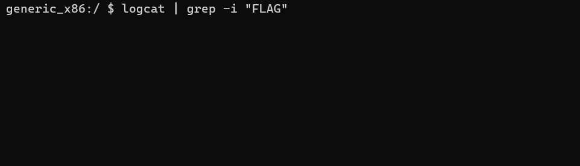

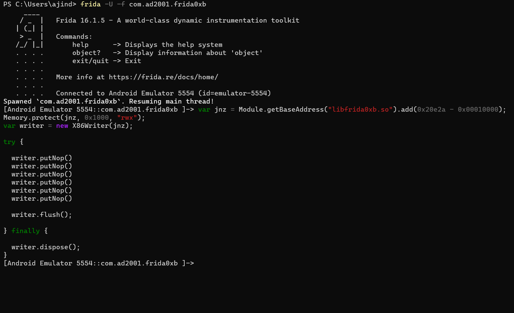

Let's click the button in our app and see if we get the flag.

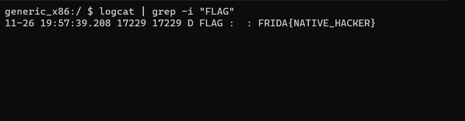

Woahhh.. We got the flag. So the patch worked !!!.

Let's try the exact thing on an ARM64 device. For ARM64 we have to use the ARM64 writer. Let's decompile the application to obtain the `libfrida0xb.so` for ARM64.

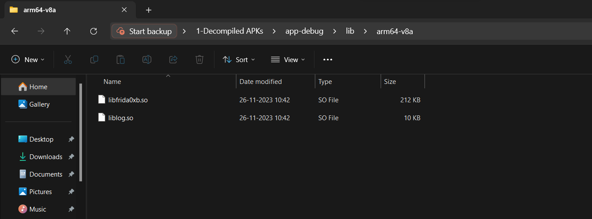

Let's use ghidra again.

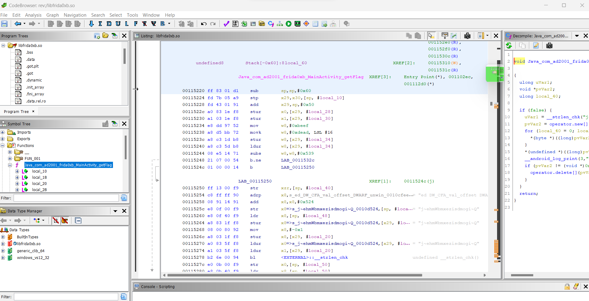

We can see the beautiful ARM64 disassembly. I'll remind you again, this is a Frida series, not a reverse engineering series, so I won't be explaining the disassembly. Let's just concentrate on the main part.

```assembly
        00115244 08  e5  14  71    subs       w8,w8,#0x539
        00115248 21  07  00  54    b.ne       LAB_0011532c
        0011524c 01  00  00  14    b          LAB_00115250
```

In x86, we saw a `cmp` instruction, but here we see a `subs` instruction. It subtracts `0x539` from 0xdeadbeef; if the result is zero, it sets the zero flag. If the zero flag is not set, the `b.ne LAB_0011532c` (branch if not  equal) instruction will jump to the location `LAB_0011532c`. otherwise, it will not jump, and the next instruction after the `b.ne LAB_0011532c` will get executed. We don't want it to jump. So similarly to what we did above, we can patch the ` b.ne ` instruction . Instead of using a `nop` instruction, let's try something different.

Let's replace the `b.ne` with a `b` instruction. This will branch to the specified label or location irrespective of the flags. We can replace the `b.ne` instruction with a branch instruction that branches directly to the next instruction.

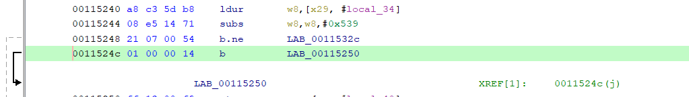


Let's use the documentation and see which method provides this instruction.

https://frida.re/docs/javascript-api/#arm64writer


Now we need to repeat the process we did above to find the address of the `b.ne` instruction and also the address of the next instruction so that we can pass this address to the `putBImm(address)` function. You can use ghidra to find the offset. I won't be explaining that again.

So after obtaining the offset, you can find the base address by using `Module.findBaseAddress("libfrida0xb.so")` and add the offset to get the actual address of the instruction. Let's write the final script.

```javascript
var adr = Module.findBaseAddress("libfrida0xb.so").add(0x15248);  // Addres of the b.ne instruction
Memory.protect(adr, 0x1000, "rwx");
var writer = new Arm64Writer(adr);  // ARM64 writer object
var target = Module.findBaseAddress("libfrida0xb.so").add(0x1524c);  // Address of the next instruction  b  LAB_00115250

try {

  writer.putBImm(target);   // Inserts the <b target> instruction in the place of b.ne instruction
  writer.flush();

  console.log(`Branch instruction inserted at ${adr}`);
} finally {

  writer.dispose();

}

```

In ARM64, you don't have to worry about the alignment of the instructions as all the instructions are 4 bytes aligned.

Okay, now let's run this script and see what happens.

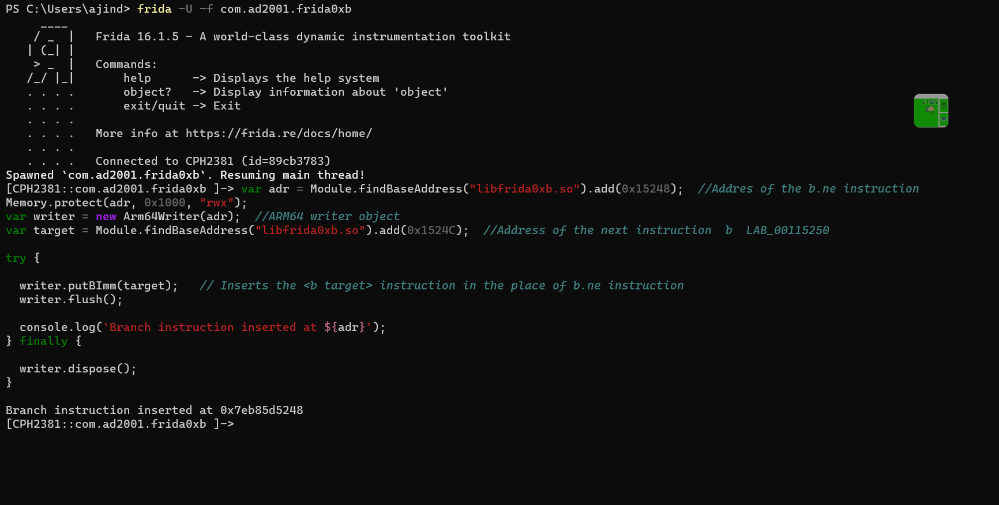

Let's click the button and check the log.

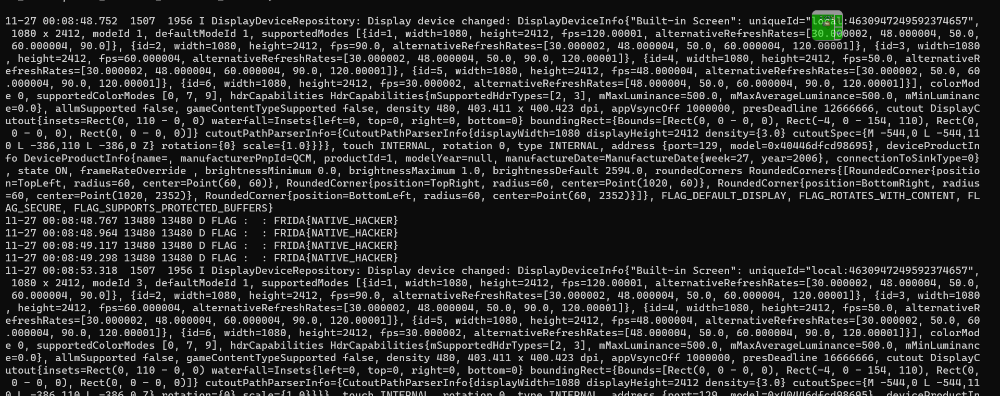

As expected we got the flag.